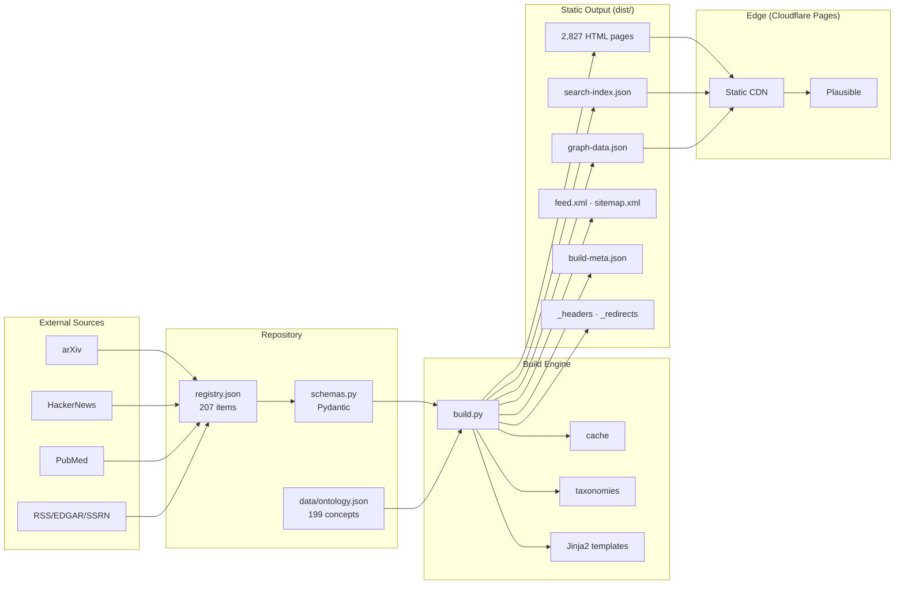

# AcaciaFund — System Architecture

> **Version:** 3.0 (URL structure) · **Last updated:** 2026-08-03
> This document is the canonical reference for the entire AcaciaFund system. It is maintained alongside the code; if a number here disagrees with another document, this document wins.

---

## 1. Introduction & Design Philosophy

### 1.1 Purpose

AcaciaFund is a **static-first, cognitive learning platform** covering three financial domains — **Compliance** (AML/CTF), **Markets**, and **Data Engineering**. It converts a JSON content registry into a fully static, edge-deployed website (2,827 pages) enriched with:

- An **ontology-backed knowledge graph** (199 concepts, 447 relations)
- **Bloom-taxonomy** content classification (Remember → Create)
- **Schema-built learning paths** (prerequisite DAGs)
- **SM-2 spaced repetition** for durable retention
- **Research provenance** (source trails, contradiction detection, evidence grading)
- **Client-side search, analytics, and interactivity** (zero server cost)

### 1.2 "Knowing vs Doing"

The platform is organized around a control-loop principle:

- **Knowing** — the static knowledge repository: reference material, compliance protocols, definitions, learn modules. Versioned in Git, built to static HTML, served at the edge.
- **Doing** — the operational surfaces: search, knowledge graph exploration, spaced-repetition review, research workspace, hypothesis testing. Implemented as client-side interactive pages over the static corpus.

An analyst can observe data, execute a task, and consult the governing rules without leaving the workflow — every interactive page cross-links to the canonical knowledge entry behind it, and every knowledge entry links back to the tools that exercise it ("Explore With").

### 1.3 Key Design Decisions (ADRs)

| # | Decision | Rationale |
|---|----------|-----------|
| 1 | **Static-first, no runtime backend** | Zero server cost, infinite edge TTL, no auth surface on content, instant global delivery. |
| 2 | **Jinja2 + custom generator over MkDocs/SSG** | Full control over 12+ page types, partials, and cognitive widgets; 2505 pages renders in ~77-100s with incremental caching. |
| 3 | **Pillar-first URLs** (`/compliance/`, `/markets/`, `/data/`) | Clean taxonomy, stable redirects, `PILLAR_URL_MAP` as single source of truth. |
| 4 | **Incremental builds via content hashing** | Only changed items re-render; unchanged pages served from cache. |
| 5 | **Client-side search** (Fuse-style scoring in vanilla JS) | Privacy-preserving, no query logging, works fully offline. |
| 6 | **Ontology-driven enrichment** | Concepts extracted from text tag pages, boost search, and build the knowledge graph. |
| 7 | **Cognitive architecture layer** | Schema builder → learning paths → SM-2 retention → adaptive presentation (see §5). |
| 8 | **Research provenance layer** | Claims mapped to citations, contradictions detected, evidence graded (see §6). |
| 9 | **Pydantic schema enforcement** | Registry validated at load; invalid items skipped-and-logged, never crash the build. |
| 10 | **Plausible analytics** | Privacy-preserving, cookie-free page analytics. |

### 1.4 Future State (not yet implemented)

Planned evolution toward an **Operational Hub** alongside the static repository:

- **FastAPI backend** serving an interactive API + frontend (`app.frontend()`) for dynamic market data and transaction-monitoring workloads.
- **Polars lazy pipelines** (and optionally dbt-core + DuckDB) for out-of-core transformations feeding the API.
- **Async task queues (ARQ/Celery) + WebSockets** for long-running analyses with live progress push.
- These remain future-state; the current system is intentionally static-first.

---

## 2. System Overview

### 2.1 Context Diagram



### 2.2 Component Map

| Component | Files | Purpose |
|-----------|-------|---------|
| Configuration | `config.py`, `config/`, `etc/` | Pillars, URLs, quality thresholds, subcategories, sources |
| Registry | `registry.json`, `schemas.py`, `core/registry_io.py`, `core/registry_store.py` | Content catalog + schema validation + persistence |
| Build Engine | `build.py`, `core/build_cache.py` | Static site generation with incremental caching |
| Taxonomy Generator | `core/build_taxonomies.py` | Admin pages, search index, tag pages, pillar pages, Atom feed |
| Ontology | `core/ontology.py`, `data/ontology.json` | Concept/relation models, extraction, graph export |
| Schema Builder | `core/schema_builder.py`, `core/learning_paths.py` | Prerequisite DAGs, learning paths, Bloom categorization |
| Retention | `core/retention_engine.py` | SM-2 algorithm, gap detection, interleaved scheduling |
| Adaptive | `core/adaptive.py` | User profiling, difficulty adaptation, content ranking |
| Provenance | `core/source_trail.py`, `core/contradiction.py`, `core/evidence_grade.py` | Claims, contradictions, GRADE-style evidence |
| Visuals | `core/compositor.py`, `core/visuals.py`, `core/extractors.py` | SVG rendering, thumbnails, OG images |
| Content Models | `core/content.py`, `core/dto.py` | Data wrappers for registry items and template context |
| Assets | `core/assets.py`, `static/` | Fingerprinting, minification, CSS/JS/fonts/images |
| Quality | `core/build_quality.py`, `core/score.py` | SQI computation, interest scoring |
| CMS | `scripts/serve_cms.py`, `scripts/cms_api.py` | Dev server + admin CRUD, versioning, media, build trigger |
| Agents | `core/agent_tools.py`, `core/agent_router.py`, `core/risk_engine.py`, `core/llm_client.py`, `scripts/agents/` | LLM-powered enrichment/research pipeline (opt-in) |
| Deploy | `.github/workflows/`, `scripts/check_links_and_sqi.py` | CI, weekly refresh, link/SQI gates |

### 2.3 Technology Stack

| Layer | Technology |
|-------|-----------|
| Language | Python 3.10+ (tested on 3.14) |
| Templating | Jinja2 |
| Data models | Pydantic v2 |
| Data processing | Polars, pyarrow (pillar-specific), pandas |
| Graph analysis | NetworkX (compliance/AML) |
| Compliance NLP | spaCy, dedupe |
| Market data | yfinance, polars |
| SQL storage | SQLAlchemy, registry.db (SQLite cache) |
| Static output | dist/ HTML + JSON (Cloudflare Pages) |
| Analytics | Plausible |
| Lint / Typecheck | Ruff, Pyright |
| Tests | Pytest (1118 Python + 106 JS), typeguard, anyio |

### 2.4 Current Metrics (verified 2026-08-03)

| Metric | Value |
|--------|-------|
| Generated pages | 2,827 |
| Registry items | 226 (102 research, 83 learn, 41 knowledge) |
| Ontology concepts | 199 (58 compliance, 64 markets, 70 data, 7 cross-pillar) |
| Ontology relations | 449 |
| Relation types | 10 |
| Knowledge categories | 13 |
| Pillar subcategories | 42 (14 × 3) |
| Inspiration sources | 32 |
| SQI (avg / min / max) | 0.871 / 0.670 / 0.955 |
| Full build time | ~93s |
| Tests | 1224 |

---

## 3. Content Pipeline

### 3.1 Data Flow

```
External Sources (arXiv, HackerNews, PubMed, RSS, EDGAR, SSRN)
        │  scripts/knowledge_ingester.py, core/sources/*
        ▼
registry.json ──► schemas.py (Pydantic validation)
        │  core/validator.py (quality + schema)
        ▼
build.py
  ├── 1. Load registry + sidecar data (ontology, freshness, synthesis, quality)
  ├── 2. Compute build hash; incremental diff via .build_manifest.json
  ├── 3. Extract ontology concepts (threshold ≥ 0.35)
  ├── 4. Render knowledge → learn → research pages
  ├── 5. Generate thumbnails, OG images, fingerprints
  ├── 6. Generate indexes, pillar pages, archives, signals dashboards
  ├── 7. Generate taxonomies (admin, search, tags, feed, sitemap)
  └── 8. Write security headers, redirects, metrics
        ▼
dist/ ──► Cloudflare Pages CDN
```

### 3.2 Registry Schema

`registry.json` is validated by `RegistryData`/`ContentItem` in `schemas.py`:

- **ContentItem**: `slug`, `title`, `content_type` (research|learn|knowledge), `pillar`, `tags`, `body_html`, `description`, `date_str`, `source_breakdown`, `sqi` (0–1), `enriched`, `citations`, `contributors`, `see_also`, `explore_tools`, `subject_classifications`, `last_verified`, `bloom_questions`, `difficulty`, `flashcards`, `technologies`.
- **RegistryData**: top-level wrapper — `last_run`, `content[]`, `pipeline_stages`, `mcp_integrations`, `planned_features`.
- `model_config = {"extra": "allow"}` — forward-compatible with new fields.
- Invalid items are **skipped-and-logged** to `dist/build_errors.log`, never fatal.

### 3.3 Incremental Build

- `core/build_cache.py` maintains `.build_manifest.json` (726 entries).
- Each item's content is hashed (registry + CSS + JS hash participates in the build hash).
- Unchanged items skip re-rendering; `parallel_map` distributes hashing/rendering across a worker pool.
- Cache version is keyed to `URL_STRUCTURE_VERSION` (bump forces full rebuild).

### 3.4 Asset Pipeline

- **JS bundling**: `scripts/bundle_js.js` concatenates modules into entry points.
- **CSS**: `static/css/design-system.css` (~2,341 lines) with `@layer` architecture; fingerprint-hashed filenames.
- **Images**: card thumbnails (200×150), SVG fractals as fallback, OG images; `core/assets.py` manages fingerprinting via `AssetManager`.

### 3.5 Build Metrics

`dist/build-meta.json` records timestamp, duration, page count, registry hash, SQI distribution, source-type counts, content counts, and quality-gate result (`gate_min_sqi: 0.65`).

---

## 4. Site Architecture

### 4.1 Pillar System

| Internal Key | URL Segment | Label | Concepts |
|---|---|---|---|
| `aml` | `compliance` | Compliance | 58 |
| `stock` | `markets` | Markets | 64 |
| `data-engineering` | `data` | Data Engineering | 70 |

- Each pillar has **14 subcategories** (42 total) defined in `config.py → PILLAR_SUBCATEGORIES`.
- `PILLAR_URL_MAP` in `config.py` is the single source of truth. **Never redefine it locally.**
- Slugs use internal keys and are translated at build time by `core/urls.py → slug_to_fspath()`.

### 4.2 URL Hierarchy

```
/
├── /compliance/              (pillar landing)
│   ├── /compliance/research/ · /compliance/learn/ · /compliance/knowledge/
│   ├── /compliance/glossary/ · /compliance/signals/
│   ├── /compliance/tags/ · /compliance/archives/ · /compliance/difficulty/ · /compliance/bloom/
│   └── /compliance/{topic}
├── /markets/                 (same structure)
├── /data/                    (same structure)
├── /knowledge/               (cross-pillar platform docs, 13 categories)
├── /learn/                   (learning hub)
├── /research/                (research index)
├── /search/                  (client-side search)
├── /graph/                   (Cytoscape knowledge graph)
├── /review/ · /review-queue/ (SM-2 review)
├── /concepts/{id}/           (192 concept detail pages)
├── /learning-paths/ · /feynman-paths/
├── /letters/{a..z}/          (A–Z browse index)
├── /weekly/ · /sources/ · /start-here/
├── /admin/*.html             (12 CMS dashboards)
├── /tags/* · /archives/* · /tools/*
└── redirects: /aml/ → /compliance/, /stock/ → /markets/, /science/ → /data/research/
```

### 4.3 Content Types

| Type | Count | Template | Purpose |
|------|-------|----------|---------|
| research | 96 | `blog_post.j2` | External-source syntheses with provenance |
| learn | 83 | `learn.j2` | Interactive modules, Bloom questions, flashcards |
| knowledge | 16 | `knowledge.j2` | Platform docs, glossaries, methodology |

### 4.4 Knowledge Categories (13)

`platform`, `guide`, `reference`, `architecture`, `foundations`, `advanced-techniques`, `best-practices`, `regulations`, `industry-analysis`, `market-analysis`, `strategies`, `methodology`, `tutorial-code`.

- Category landing pages are generated at `/knowledge/{cat}/`.
- Categories with no items get **empty placeholder pages** so all category links resolve.

### 4.5 Cross-Linking Model

- Every knowledge entry links to related research/learn and its ontology concepts.
- Every interactive page (graph, search, review) links back to canonical entries.
- `find_cross_pillar()` surfaces same-concept content across pillars.

---

## 5. Cognitive Architecture

### 5.1 Schema Builder (`core/schema_builder.py`)

- `build_prerequisite_graph()` — directed DAG from `requires` relations; cycles rejected with warning.
- `compute_learning_paths()` — BFS from a start concept, depth-limited.
- `categorize_by_bloom()` — root→Remember, mid-chain→Apply/Analyze, deep→Evaluate/Create.
- `compute_feynman_learning_paths()` / `compute_cross_pillar_feynman_paths()` — Feynman-technique-scaffolded paths.

### 5.2 Learning Paths (`core/learning_paths.py`)

- `build_all_learning_paths()`, `enrich_journeys_with_content()`, `generate_cross_pillar_synthesis()`, `generate_learning_path_context()`.
- Output: 15 learning-path pages + 3 pillar synthesis pages with analog matrices (epistemic-status mapping across pillars).

### 5.3 Spaced Repetition (`core/retention_engine.py`)

- SM-2 algorithm with ease-factor mapping.
- Gap detection (unseen, overdue 7+ days, low-mastery < 0.3).
- Interleaved practice scheduler mixing all 3 pillars.
- `static/review_concepts.json` generated at build (199 concepts with metadata).
- Rendered in `/review/` (mastery dashboard) and `/review-queue/` (flashcard queue) via `static/js/retention_engine.js`.

### 5.4 Adaptive Presentation (`core/adaptive.py`)

- `UserProfile` (knowledge level, pillar interest, modality preference).
- Difficulty adaptation, modality suggestion, content ranking.
- Density controls (compact/standard/comfortable) persisted in localStorage.

### 5.5 Cognitive-Load Controls

- **Progressive disclosure** (`static/js/progressive_disclosure.js`) — collapsible sections, session state.
- **Pre-test gate** (`partials/pretest_gate.j2` + `pretest_gate.js`) — quiz attempt required before content.
- **Generation flashcards** — `data-generate` write-before-flip mode.
- **Visual abstracts** (dual coding) — SVG icon + 3-bullet summary.
- **Article metadata collapsible** — 3-element headers minimize split attention.

---

## 6. Research Provenance System

### 6.1 Source Trails (`core/source_trail.py`)

- `SourceTrailManager` maps claims → citations.
- `extract_claims_from_text()`, `extract_citations_from_text()`, `build_trails_for_item()`.

### 6.2 Contradiction Detection (`core/contradiction.py`)

- `ContradictionDetector` — negation, antonym, and numeric contradiction detection.
- Contradiction clustering across the corpus.

### 6.3 Evidence Grading (`core/evidence_grade.py`)

- GRADE-style evidence quality scoring.
- Downgrade/upgrade criteria integrated with contradiction detection.

### 6.4 Workspace & Export

- `/research-workspace/` — hypothesis workspace with claim/contradiction/evidence views.
- `scripts/export_research.py` — Markdown/JSON report export.

---

## 7. Template System

### 7.1 Hierarchy

```
layout.j2
├── index.j2                  (homepage)
├── research.j2 / learn.j2 / knowledge.j2 / blog_post.j2
├── pillar_index.j2 / category_index.j2 / tag_index.j2
├── learn_index.j2 / knowledge_index.j2 / alpha_index.j2 / weekly_index.j2
├── graph.j2 / search.j2 / concept_detail.j2
├── review.j2 / review_queue.j2 / research_workspace.j2
├── learning_path.j2 / feynman_learning_path.j2 / feynman_cross_pillar_path.j2 / pillar_synthesis.j2
├── aml_signals.j2 / source_trust.j2 / start_here.j2 / 404.j2
└── admin/
    └── base.html → dashboard, cms_*, article_list, quality, coverage,
                    telemetry, pipeline, sources, ontology, feynman, manifest,
                    gallery, curated_tester, login
```

### 7.2 Partials & Macros

- **Partials** (15): `visual_abstract`, `concept_map`, `article_metadata`, `article_image`, `pretest_gate`, `philosophical_lineage`, `epistemic_badge`, `normative_basis`, `cross_pillar_philosophy`, `citation`, `contributor`, `explore_tools`, `see_also`, `freshness_badge`, `feynman_card`, `newsletter`.
- **Macros** (2): `pillar_badge.html`, `breadcrumbs.html`.

### 7.3 Context Variables

Key globals injected via `env.globals`/`ctx_base`: `slug_to_url`, `pillar_to_url`, `resolve_topic_icon`, `render_topic_icon`, `_pick_subtopic`, `build_hash`, `year`, `site_url`, `pillar_config`, `pillar_emojis`, `pillar_names`, `site_description`, `resolve_card_image`; filters `reading_time`, `urlencode`, `pictogram`, `asset`, `format_date`, `filter_entities`, `wrap_prose_sections`, `content_subtype`.

---

## 8. Static Assets & Design System

| Asset | Description |
|-------|-------------|
| `static/css/design-system.css` | Main stylesheet (~2,341 lines), `@layer` architecture: tokens, base, components, utilities |
| `static/css/vendor/` | Pico CSS + Inter font loader |
| `static/js/main.js` | Reading progress, dark mode, keyboard shortcuts, mobile nav |
| `static/js/search.js` | Client-side fuzzy search + autocomplete + facet filters |
| `static/js/retention_engine.js` | SM-2 client, mastery dashboard, interleaved sessions |
| `static/js/progressive_disclosure.js` | Collapsible sections |
| `static/js/pretest_gate.js` | Retrieval-before-exposure gate |
| `static/js/learning_hub.js` | Flashcards, write-before-flip |
| `static/js/feynman_synthesis.js` | Feynman path interactivity |
| `static/fonts/` | Inter variable font (18 subsets) |
| `static/images/generated/` | Auto-generated thumbnails + OG images |
| `static/uploads/` | CMS media uploads (UUID-named, thumbnails cached) |

Security headers in `dist/_headers`: CSP, HSTS, CORS, X-Content-Type-Options, frame/cache policies.

---

## 9. Admin CMS

### 9.1 Architecture

- `scripts/serve_cms.py` — Python `HTTPServer` + `SimpleHTTPRequestHandler` (no web framework).
- `scripts/cms_api.py` — `CMS` class: `list`, `get`, `create`, `update`, `delete`, `build`, `list_versions`, `restore_version`, `stats`, `list_concepts`.
- Admin templates rendered via Jinja2 with live registry data; static files served from `dist/`.
- Directory→`index.html` resolution ensures clean 200s on all public routes.

### 9.2 API Endpoints

| Endpoint | Method | Purpose |
|----------|--------|---------|
| `/admin/cms_list.html` | GET | Content list (paginated, filterable) |
| `/admin/cms_editor.html` | GET | Create/edit with preview |
| `/admin/cms_media.html` | GET | Media library |
| `/admin/cms_dashboard.html` | GET | CMS status dashboard |
| `/api/cms/stats` | GET | Registry statistics |
| `/api/cms/versions` | GET | Version history for a slug |
| `/api/cms/suggest` | GET | Autocomplete (query + pillar + type) |
| `/api/cms/export` | GET | Export items as JSON |
| `/api/cms/media/list` | GET | List media files |
| `/api/cms/save` | POST | Create/update item (auto-backup) |
| `/api/cms/delete` | POST | Delete item |
| `/api/cms/duplicate` | POST | Duplicate item |
| `/api/cms/media/upload` | POST | Upload media (max 10 MB) |
| `/api/cms/media/delete` | POST | Delete media |
| `/api/cms/build` | POST | Trigger build (background thread, single-flight) |
| `/api/cms/restore` | POST | Restore a previous version |

### 9.3 Versioning & Safety

- Auto-backup of `registry.json` before every save (`.registry_backups/`, last 20 kept).
- Per-item version history (`.registry_versions/`).
- Media stored in `static/uploads/` with UUID filenames (PNG/JPG/GIF/WebP/SVG/ICO).
- CORS `*` on API endpoints (dev server).

---

## 10. Development & Operations

### 10.1 Build Commands

```bash
python3 build.py                                # incremental
rm -rf dist .build_cache.json && python3 build.py   # full rebuild
python3 scripts/serve_cms.py                    # local server + CMS (port 8000)
python3 scripts/check_links_and_sqi.py --dist-dir dist   # link + SQI gate
python3 -m pytest tests/ -v                     # all tests
ruff check . ; pyright                          # lint + typecheck
bash scripts/run_tests.sh                       # full test suite wrapper
```

### 10.2 Testing

- **1118 Python tests** across 48 modules + **106 JS tests** across 4 files (`test_progressive_disclosure.js`, `test_toc.js`, `test_adaptive_ui.js`, `test_search_discovery.js`).
- Coverage highlights: ontology (39), build_taxonomies (51), retention (38), contradiction (40), generate_pages (40), ingestion (64), adaptive (31), schema_builder (29).
- Golden rules: use `python3`; tests import from `core/urls.py` (not `build.py`) to avoid heavy deps; timeout long runs.

### 10.3 Deployment

- **Cloudflare Pages** at `https://www.acaciafund.org/` triggered via `workflow_dispatch` (`.github/workflows/`).
- **Weekly refresh** (Monday 04:00 UTC): ontology regeneration, glossaries, source synthesis, freshness checks (32 sources), full rebuild, link/SQI audit, artifact upload, data commit.
- `dist/_redirects` — 181 redirect rules; `dist/_headers` — security headers.

### 10.4 Observability

- **Plausible** page analytics (privacy-preserving).
- **Source freshness** — `scripts/check_source_freshness.py` HEAD-checks 32 sources weekly; status categories active/degraded/error.
- **Build metrics** — `dist/build-meta.json` per build; `dist/build_errors.log` for skipped/invalid items.
- **Link + SQI gate** — `scripts/check_links_and_sqi.py` reports broken internal links, SQI distribution, external reference inventory.

### 10.5 Security Model

- Admin dashboards behind `admin/login.html` (credentials in environment).
- CSP/HSTS/CORS/X-Content-Type-Options via `_headers`.
- `core/risk_engine.py` gates agent-tool execution (auto/CLI-approval callbacks).
- Secrets in `.env`; never committed.

### 10.6 Troubleshooting

| Symptom | Fix |
|---------|-----|
| Build skips items | Delete `.build_cache.json` + `dist`, full rebuild |
| Tests hang importing `build.py` | Import `core/urls.py`; run with `timeout` |
| Stale `/aml/` paths | Re-run slug migration; ensure scripts import from `config` |
| Search index empty | Check `static/search-index.json`; full rebuild |
| Admin pages blank | Ensure templates extend `admin/base.html`; pass `active_page` |
| Source freshness missing | `python3 scripts/check_source_freshness.py --update-ontology` |
| `build_errors.log` non-empty | Inspect for Jinja2/registry/import failures |

---

## 11. Extension Points

### 11.1 Adding a Pillar

1. Add entry to `PILLAR_URL_MAP`/`PILLAR_REVERSE`, `PILLAR_NAMES`, `PILLAR_EMOJIS`, `PILLAR_COLORS`, `PILLAR_CONFIG` in `config.py`.
2. Add 14 subcategories to `PILLAR_SUBCATEGORIES`.
3. Add `[inspiration_sources]` to `etc/pillars.toml`.
4. Bump `URL_STRUCTURE_VERSION` (forces full rebuild).

### 11.2 Adding a Content Type

1. Extend `ContentItem.content_type` Literal in `schemas.py`.
2. Create a template; register content-type label via `content_subtype` filter.
3. Add rendering branch in `build.py` content phases.
4. Extend `CONTENT_TYPES` in `scripts/cms_api.py`.

### 11.3 Adding a Knowledge Category

1. Add entry to `KNOWLEDGE_CATEGORIES` in `build.py` (label, icon, color, description).
2. Assign `knowledge_category` on registry items; empty categories auto-generate placeholder pages.

### 11.4 The Agentic Pipeline

`python3 build.py --run-agents [--agent-pillar X] [--agent-max-items N]` runs enrichment, research, learn, glossary, and synthesis agents (`scripts/agents/`) via `core/llm_client.py` and `core/risk_engine.py`. Optional, LLM-backed, gated by the risk engine.

---

## 12. Appendix

### 12.1 Configuration Reference (key `config.py` constants)

`SITE_URL`, `SITE_NAME`, `REGISTRY_PATH`, `TEMPLATE_DIR`, `OUTPUT_DIR`, `SQI_THRESHOLD_MIN` (0.65), `SQI_BADGE_HIGH/MED`, `SQI_DEFAULT`, `URL_STRUCTURE_VERSION` (3.0), `PILLAR_URL_MAP`, `PILLAR_SUBCATEGORIES`, `KNOWLEDGE_TO_PILLAR_CATEGORY`, `PILLAR_CONFIG/COLORS/FINGERPRINT_COLORS`.

### 12.2 Data Model Reference

`ContentItem` and `RegistryData` — see [`schemas.py`](schemas.py) and `docs/03-content-system/registry-schema.md`.

### 12.3 CLI Command Index

See `docs/reference/cli-commands.md` (30+ commands).

### 12.4 Glossary

| Term | Definition |
|------|-----------|
| Pillar | One of three domains (Compliance, Markets, Data Engineering) |
| SQI | Semantic Quality Index (0–1); quality gate at 0.65 |
| Bloom level | Remember/Understand/Apply/Analyze/Evaluate/Create |
| Feynman path | Learning path scaffolded by the Feynman technique |
| Epistemic status | Philosophical metadata on every concept (Constitutive/Instrumental/Regulatory/…) |
| SM-2 | Spaced-repetition scheduling algorithm |
| DLQ | Dead-letter queue for failed processing |
