# URL Structure

AcaciaFund uses a **pillar-first** URL hierarchy. Each content pillar has its own URL segment, with content types as sub-paths.

## Pillar Mapping

| Internal Key | URL Segment | Display Label |
|---|---|---|
| `aml` | `compliance` | Compliance |
| `stock` | `markets` | Markets |
| `data-engineering` | `data` | Data Engineering |

**Single source of truth:** `config.py` → `PILLAR_URL_MAP`

## URL Hierarchy

```
/
├── compliance/                    # AML pillar landing page
│   ├── research/{topic}/          # Research articles
│   ├── learn/{topic}/             # Learning modules
│   ├── knowledge/{topic}/         # Knowledge base articles
│   └── signals/                   # Compliance signals dashboard
├── markets/                       # Stock pillar landing page
│   ├── research/{topic}/
│   ├── learn/{topic}/
│   ├── knowledge/{topic}/
│   └── signals/
├── data/                          # Data Engineering pillar landing page
│   ├── research/{topic}/
│   ├── learn/{topic}/
│   ├── knowledge/{topic}/
│   └── signals/
├── knowledge/                     # Platform pages (cross-pillar)
│   ├── about/
│   ├── faq/
│   ├── glossary/
│   └── ...
├── research/                      # Cross-pillar research index
├── learn/                         # Cross-pillar learn index
├── tags/{tag}/                    # Tag archive pages
├── graph/                         # Knowledge graph visualization
├── search/                        # Full-text search
└── feed.xml                       # Atom feed
```

## Redirect Rules

Old paths are redirected to new paths via Cloudflare Pages `_redirects`:

```
/aml/*          /compliance/:splat   301
/aml/signals/*  /compliance/signals/:splat  301
/stock/*        /markets/:splat      301
/stock/signals/*  /markets/signals/:splat  301
/science/*      /research/:splat     301
/contact/*      /knowledge/contact/:splat  301
```

A meta-refresh redirect page is also generated at `dist/aml/index.html` → `/compliance/`.

## Slug Translation

Content slugs in `registry.json` use **internal pillar keys** (e.g., `aml/research/foo`). The build system translates these to URL segments via `slug_to_fspath()` in `core/urls.py`:

```
Internal slug:              Filesystem path:
aml/research/foo      →     compliance/research/foo/index.html
aml/learn/bar         →     compliance/learn/bar/index.html
knowledge/about       →     knowledge/about/index.html  (unchanged)
```

## Helper Functions

All URL helpers are in `core/urls.py` (lightweight, no heavy dependencies):

- `pillar_to_url(pillar)` — internal key → URL segment
- `url_to_pillar(url_seg)` — URL segment → internal key
- `slug_to_fspath(slug)` — internal slug → filesystem path
- `slug_to_url(slug)` — internal slug → full canonical URL
- `canonical_path(path)` — normalize path (strip index.html, trailing slash)
- `slug_to_path(slug)` — slug → output file path

## Architecture Diagram

```mermaid
graph TD
    Root["/"] --> Compliance["/compliance/"]
    Root --> Markets["/markets/"]
    Root --> Data["/data/"]
    Root --> Knowledge["/knowledge/"]
    Root --> Tags["/tags/"]

    Compliance --> CR["/compliance/research/..."]
    Compliance --> CL["/compliance/learn/..."]
    Compliance --> CK["/compliance/knowledge/..."]
    Compliance --> CS["/compliance/signals/"]

    Markets --> MR["/markets/research/..."]
    Markets --> ML["/markets/learn/..."]
    Markets --> MK["/markets/knowledge/..."]
    Markets --> MS["/markets/signals/"]

    Data --> DR["/data/research/..."]
    Data --> DL["/data/learn/..."]
    Data --> DK["/data/knowledge/..."]
    Data --> DS["/data/signals/"]

    Knowledge --> KA["/knowledge/about"]
    Knowledge --> KF["/knowledge/faq"]
    Knowledge --> KG["/knowledge/glossary"]

    style Compliance fill:#f59e0b,stroke:#1e293b,color:#1e293b
    style Markets fill:#10b981,stroke:#1e293b,color:#fff
    style Data fill:#3b82f6,stroke:#1e293b,color:#fff
```


