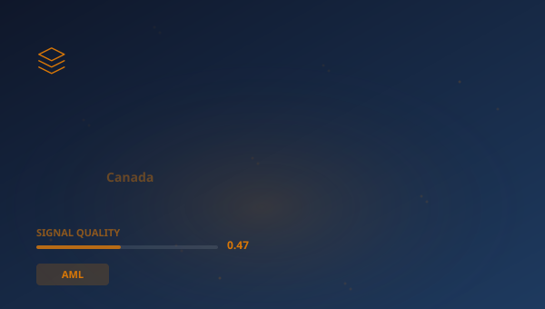

## 🔍 Trending (HackerNews, 2026-06-01)

1. [EY Canada published a cybersecurity report and most citations were hallucinated](https://gptzero.me/investigations/ey) ([discussion](https://news.ycombinator.com/item?id=48339580)) (320 pts)
2. [White House's Aliens.gov Site Brags That ICE Arrested More Than 700 US Citizens](https://www.wired.com/story/white-house-aliens-gov-us-citizens-arrested/) ([discussion](https://news.ycombinator.com/item?id=48339127)) (54 pts)
3. [Iran stops negotiations with U.S., vows to 'completely' block Strait of Hormuz](https://www.cnbc.com/2026/06/01/iran-us-negotiations-strait-of-hormuz.html) ([discussion](https://news.ycombinator.com/item?id=48357637)) (40 pts)
4. [California passes bill criminalizing bypass of 3D printer gun-blocking software](https://www.tomshardware.com/3d-printing/california-assembly-passes-3d-printer-bill-that-would-criminalize-bypassing-mandated-gun-blocking-software) ([discussion](https://news.ycombinator.com/item?id=48345216)) (12 pts)
5. [The Infosec Phrasebook](https://nesbitt.io/2026/06/01/the-infosec-phrasebook.html) ([discussion](https://news.ycombinator.com/item?id=48355520)) (9 pts)
6. [Guidelines for Respectful Use of AI](https://www.elidedbranches.com/) ([discussion](https://news.ycombinator.com/item?id=48348360)) (8 pts)
7. [Show HN: Postbase – 100% open source Alternative to Firebase and Supabase [video]](https://www.youtube.com/watch?v=St_kJZXZ_nE) ([discussion](https://news.ycombinator.com/item?id=48354865)) (7 pts)

> **Summary**
>Today in Evolution of resilience systems in the financial sector, the top story is "**EY Canada published a cybersecurity report and most citations were hallucinated**", which gathered 320 points on Hacker News -- nearly 18x higher than the average of other articles. This is a strong signal that the topic resonates broadly. Sources are diverse (5 categories) -- the topic cuts across different circles. Key numbers include: 150; 2025,; 44. Key entities: **SEC**, **Block**, **OCC**, **Fed**. In the background: "White House's Aliens.gov Site Brags That ICE Arrested More Than 700...", "Iran stops negotiations with U.S., vows to 'completely' block Strait...". Total: 30 articles with 530 points. Average SQI (Signal Quality Index): 0.465. That's all for today -- more tomorrow.

## 📊 Analysis

**Key entities:** `SEC` · `Block` · `OCC` · `Fed` · `Loyalty Systems` · `Citi`
**Key numbers:** 150 · 2025, · 44 · 200billion
**From articles:**
- EY Tower, Toronto — as seen from GPTZero’s office Ernst & Young is one of the “big four” global consulting firms, provid
- X with a 10-second video captioned “They walk among us,” leading many users to suspect an announcement about UFOs—the su
- Also, the resistance front and Iran have resolved to completely block the Strait of Hormuz and activate other fronts inc

## 🧠 Bloom Taxonomy Questions
1. **Remembering**: Which domain does the article "Show HN: DropLock – E2EE secret sharing web app with no back…" come from?
2. **Understanding**: What type of domain is wired.com?
3. **Applying**: How can concepts from the article "Mumbai's famed dabbawalas fed millions for over 100 years" be applied in practice in AML?
4. **Creating**: Based on articles from AML, propose a new research direction or project inspired by the topic "Citadel".

## 📚 Flashcards
- **CTF**: Counter-Terrorism Financing
- **EBA**: European Banking Authority
- **FCA**: Financial Conduct Authority — UK financial regulator
- **Fed**: Federal Reserve System — US central bank
- **HN**: Hacker News — tech industry social platform
- **LLM**: Large Language Model
- **OCC**: Office of the Comptroller of the Currency — US bank supervisor
- **SEC**: Securities and Exchange Commission — US securities regulator

> 

## 🧪 Classification quality

Classification: 57% (1030/1793) | Pillar share: 3%

---
*Report generated 2026-06-01. Source: Algolia HN API. Classification: AcaciaFund NLP. SQI: 0.465.*
