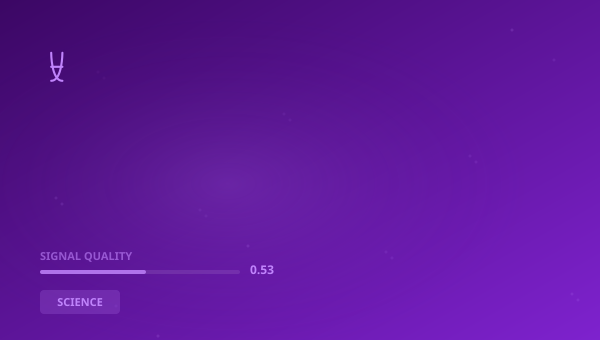

## 🔍 Trending (HackerNews, 2026-06-01)

1. [A pictorial introduction to differential geometry (2017)](https://arxiv.org/abs/1709.08492) ([discussion](https://news.ycombinator.com/item?id=48343287)) (134 pts)
2. [New solar desalination breakthrough makes fresh water without toxic brine](https://www.sciencedaily.com/releases/2026/05/260530053418.htm) ([discussion](https://news.ycombinator.com/item?id=48349507)) (85 pts)
3. [The people who actually want AI to replace humanity](https://www.vox.com/future-perfect/489976/ai-successionism-transhumanism-posthumanism) ([discussion](https://news.ycombinator.com/item?id=48345881)) (78 pts)
4. [An Elephant Who Demonstrated That Her Species Might Be Self-Aware, Dies at 55](https://www.smithsonianmag.com/smart-news/happy-an-asian-elephant-who-demonstrated-that-her-species-might-be-self-aware-dies-at-55-at-the-bronx-zoo-180988861/) ([discussion](https://news.ycombinator.com/item?id=48341372)) (58 pts)
5. [Rubin Tracks Skyscraper-Size Asteroids and Failed Supernovas](https://www.quantamagazine.org/rubin-tracks-skyscraper-size-asteroids-failed-supernovas-and-interstellar-visitors-20260515/) ([discussion](https://news.ycombinator.com/item?id=48352500)) (50 pts)
6. [Rotary GPU: Exploring Local Execution for Large MoE Models Under Limited VRAM](https://arxiv.org/abs/2605.29135) ([discussion](https://news.ycombinator.com/item?id=48340616)) (40 pts)
7. [$100 to a Debian Developer who can get Fresh Editor into Trixie](https://news.ycombinator.com/item?id=48347180) (25 pts)

> **Summary**
>Today in Science, complex systems, and cognitive evolution, the top story is "**A pictorial introduction to differential geometry (2017)**", which gathered 134 points on Hacker News -- nearly 6x higher than the average of other articles. This is a strong signal that the topic resonates broadly. Sources are diverse (3 categories) -- the topic cuts across different circles. Key numbers include: 50; 2015,; 2022.. Key entities: **WHO**, **MIT**, **ESA**, **Wildlife Conservation Society**. In the background: "New solar desalination breakthrough makes fresh water without toxic...", "The people who actually want AI to replace humanity". Total: 30 articles with 629 points. Average SQI (Signal Quality Index): 0.532. That's all for today -- more tomorrow.

## 📊 Analysis

**Key entities:** `WHO` · `MIT` · `ESA` · `Wildlife Conservation Society` · `University Belfast` · `Curtin University`
**Key numbers:** 50 · 2015, · 2022. · 23
**From articles:**
- XivLabs is a framework that allows collaborators to develop and share new arXiv features directly on our website.
- Laser-Treated Solar Panels Drive the Process The system relies on specially engineered solar panels made from black meta
- When news breaks, you need to understand what actually matters — and what to do about it.

## 🧠 Bloom Taxonomy Questions
1. **Remembering**: Which domain does the article "If LLMs Have Human-Like Attributes, Then So Does Age of Empi…" come from?
2. **Understanding**: Is the following statement true according to the article "An Elephant Who Demonstrated That Her Species Might Be Self-…"?
3. **Analyzing**: Which of these articles comes from a educational/government source?

## 📚 Flashcards
- **CERN**: European Organization for Nuclear Research
- **GPU**: Graphics Processing Unit
- **Harvard**: Harvard University — oldest US university
- **HN**: Hacker News — tech industry social platform
- **LLM**: Large Language Model
- **MIT**: Massachusetts Institute of Technology
- **WHO**: World Health Organization
- **Tracks Skyscraper**: Topic from article: Rubin Tracks Skyscraper-Size Asteroids and Failed Supernovas

> 

## 🧪 Classification quality

Classification: 57% (1030/1793) | Pillar share: 3%

---
*Report generated 2026-06-01. Source: Algolia HN API. Classification: AcaciaFund NLP. SQI: 0.532.*
