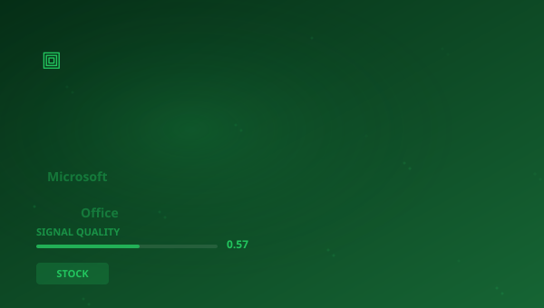

## 🔍 Trending (HackerNews, 2026-06-01)

1. [Microsoft Office 2019 and 2021 for Mac view-only conversion](https://consumerrights.wiki/w/Microsoft_Office_2019_and_2021_for_Mac_view-only_conversion_(2026)) ([discussion](https://news.ycombinator.com/item?id=48341578)) (998 pts)
2. [I put a datacenter GPU in my gaming PC](https://blog.tymscar.com/posts/v100localllm/) ([discussion](https://news.ycombinator.com/item?id=48345694)) (318 pts)
3. [ChatGPT for Google Sheets exfiltrates workbooks](https://www.promptarmor.com/resources/gpt-for-google-sheets-data-exfiltration) ([discussion](https://news.ycombinator.com/item?id=48349487)) (297 pts)
4. [Meta launches Instagram, Facebook, and WhatsApp subscriptions](https://techcrunch.com/2026/05/27/meta-officially-launches-instagram-facebook-and-whatsapp-subscriptions-with-more-to-come-including-ai-plans/) ([discussion](https://news.ycombinator.com/item?id=48347354)) (263 pts)
5. [Odysseus – self-hosted AI workspace](https://github.com/pewdiepie-archdaemon/odysseus) ([discussion](https://news.ycombinator.com/item?id=48346693)) (199 pts)
6. [Microcode inside the Intel 8087 floating-point chip: register exchange](https://www.righto.com/2026/05/microcode-inside-intel-8087-floating.html) ([discussion](https://news.ycombinator.com/item?id=48338656)) (129 pts)
7. [No Raise, No Promotion: 1 in 4 White-Collar Workers Are Stalling Out](https://www.wsj.com/lifestyle/careers/white-collar-workers-career-nyu-study-a81a7d9c) ([discussion](https://news.ycombinator.com/item?id=48357063)) (112 pts)

> **Summary**
>Today in Capital markets and semiconductor analysis, the top story is "**Microsoft Office 2019 and 2021 for Mac view-only conversion**", which gathered 998 points on Hacker News -- nearly 10x higher than the average of other articles. This is a strong signal that the topic resonates broadly. Sources are diverse (5 categories) -- the topic cuts across different circles. Key numbers include: 2019; 2023,; 13,. Key entities: **NVIDIA**, **Meta**, **Intel**, **Microsoft Office**. In the background: "I put a datacenter GPU in my gaming PC", "ChatGPT for Google Sheets exfiltrates workbooks". Total: 30 articles with 3088 points. Average SQI (Signal Quality Index): 0.574. That's all for today -- more tomorrow.

## 📊 Analysis

**Key entities:** `NVIDIA` · `Meta` · `Intel` · `Microsoft Office` · `Office Home` · `Google`
**Key numbers:** 2019 · 2023, · 13, · 2026
**From articles:**
- In the launch blog post, Microsoft's Jared Spataro wrote that"Office 2019 is a one-time release and won't receive future
- I bought a datacenter GPU that doesn’t even have a normal PCIe connector, stuck it in my gaming PC with an adapter, and 
- Display of an interactive phishing pop-up Overwriting the entire GPT sidebar with an attacker-controlled chatbot interfa

## 🧠 Bloom Taxonomy Questions
1. **Remembering**: Which domain does the article "MacBook Pro Rival with the Nvidia Powered Surface Laptop Ult…" come from?
2. **Understanding**: Why is the article "Can dents and gouges compromise the structural integrity of …" relevant to STOCK?
3. **Evaluating**: What is the credibility level of the source arxiv.org?

## 📚 Flashcards
- **ASIC**: Application-Specific Integrated Circuit
- **ASML**: Dutch lithography machine manufacturer for the semiconductor industry
- **GPU**: Graphics Processing Unit
- **HN**: Hacker News — tech industry social platform
- **Intel**: World's largest x86 processor manufacturer
- **IPO**: Initial Public Offering
- **LLM**: Large Language Model
- **NVIDIA**: GPU manufacturer and AI computing leader

> 

## 🧪 Classification quality

Classification: 57% (1030/1793) | Pillar share: 3%

---
*Report generated 2026-06-01. Source: Algolia HN API. Classification: AcaciaFund NLP. SQI: 0.574.*
