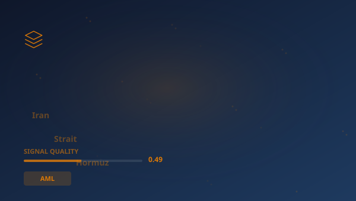

## 🔍 Trending (HackerNews, 2026-06-02)

1. [Iran stops negotiations with U.S., vows to 'completely' block Strait of Hormuz](https://www.cnbc.com/2026/06/01/iran-us-negotiations-strait-of-hormuz.html) ([discussion](https://news.ycombinator.com/item?id=48357637)) (101 pts)
2. [Show HN: Eyeball](https://eyeball.rory.codes/) ([discussion](https://news.ycombinator.com/item?id=48367723)) (60 pts)
3. [The Infosec Phrasebook](https://nesbitt.io/2026/06/01/the-infosec-phrasebook.html) ([discussion](https://news.ycombinator.com/item?id=48355520)) (41 pts)
4. [Visa invests in Replit to power agentic payments for developers](https://techcrunch.com/2026/05/28/visa-invests-in-replit-to-power-agentic-payments-for-developers/) ([discussion](https://news.ycombinator.com/item?id=48359854)) (19 pts)
5. [We Are Living in Pinocchio's World](https://om.co/2026/05/25/we-are-living-in-pinocchios-world/) ([discussion](https://news.ycombinator.com/item?id=48362108)) (16 pts)
6. [Israel doing everything to derail diplomacy by turning Lebanon into another Gaza](https://www.commondreams.org/news/israel-lebanon-war) ([discussion](https://news.ycombinator.com/item?id=48361867)) (12 pts)
7. [Show HN: Postbase – 100% open source Alternative to Firebase and Supabase [video]](https://www.youtube.com/watch?v=St_kJZXZ_nE) ([discussion](https://news.ycombinator.com/item?id=48354865)) (11 pts)

> **Summary**
>Today in Evolution of resilience systems in the financial sector, the top story is "**Iran stops negotiations with U.S., vows to 'completely' block Strait of Hormuz**", which gathered 101 points on Hacker News -- nearly 8x higher than the average of other articles. This is a strong signal that the topic resonates broadly. Sources are diverse (5 categories) -- the topic cuts across different circles. Key numbers include: 7%; 100; 1,000. Key entities: **SEC**, **EBA**, **Block**, **OCC**. In the background: "Show HN: Eyeball", "The Infosec Phrasebook". Total: 30 articles with 370 points. Average SQI (Signal Quality Index): 0.489. That's all for today -- more tomorrow.

## 📊 Analysis

**Key entities:** `SEC` · `EBA` · `Block` · `OCC` · `Fed` · `Microsoft`
**Key numbers:** 7% · 100 · 1,000 · 200,000
**From articles:**
- Also, the resistance front and Iran have resolved to completely block the Strait of Hormuz and activate other fronts inc
- It has a faintly military air and a noticeable per-syllable markup on vendor invoices.
- Commerce, as well as Visa’s Trusted Agent Protocol — a system that allows AI agents to securely identify themselves by s

### 🔗 Cross-pillar connections
- "Anthropic files for blockbuster initial public offering" has connections to **SCIENCE** (score: 9)

## 🧠 Bloom Taxonomy Questions
1. **Remembering**: Which domain does the article "Show HN: Postbase – 100% open source Alternative to Firebase…" come from?
2. **Understanding**: What type of domain is gizmodo.com?
3. **Applying**: How can concepts from the article "Crypto Security Pioneer: 'I Now Consider All of DeFi Unsafe'" be applied in practice in AML?

## 📚 Flashcards
- **Anthropic**: AI company building the Claude model
- **CTF**: Counter-Terrorism Financing
- **EBA**: European Banking Authority
- **FCA**: Financial Conduct Authority — UK financial regulator
- **Fed**: Federal Reserve System — US central bank
- **HN**: Hacker News — tech industry social platform
- **OCC**: Office of the Comptroller of the Currency — US bank supervisor
- **SEC**: Securities and Exchange Commission — US securities regulator

> 

## 🧪 Classification quality

Classification: 59% (1030/1742) | Pillar share: 3%

---
*Report generated 2026-06-02. Source: Algolia HN API. Classification: AcaciaFund NLP. SQI: 0.489.*
