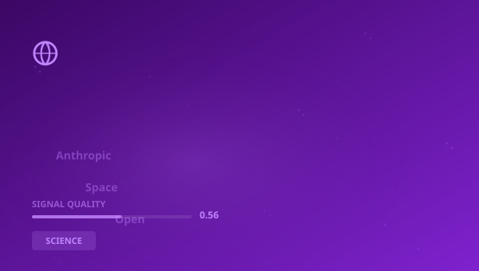

## 🔍 Trending (HackerNews, 2026-06-02)

1. [Can the stockmarket swallow Anthropic, SpaceX and OpenAI?](https://www.economist.com/finance-and-economics/2026/06/01/can-the-stockmarket-swallow-anthropic-spacex-and-openai) ([discussion](https://news.ycombinator.com/item?id=48364055)) (534 pts)
2. [Anthropic confidentially submits draft S-1 to the SEC](https://www.anthropic.com/news/confidential-draft-s1-sec) ([discussion](https://news.ycombinator.com/item?id=48358646)) (508 pts)
3. [AI Agent Guidelines for CS336 at Stanford](https://github.com/stanford-cs336/assignment1-basics/blob/main/CLAUDE.md) ([discussion](https://news.ycombinator.com/item?id=48359232)) (461 pts)
4. [What appear to be biochemical processes may be a natural feature of geology](https://www.quantamagazine.org/the-dirt-that-refused-to-die-20260601/) ([discussion](https://news.ycombinator.com/item?id=48357905)) (253 pts)
5. [Ask HN: Who is hiring? (June 2026)](https://news.ycombinator.com/item?id=48357725) (213 pts)
6. [Ask HN: Who wants to be hired? (June 2026)](https://news.ycombinator.com/item?id=48357724) (132 pts)
7. [Michael Burry says neither SpaceX nor Anthropic is worth $1T](https://www.businessinsider.com/big-short-michael-burry-spacex-anthropic-ipo-ai-bubble-claude-2026-6) ([discussion](https://news.ycombinator.com/item?id=48368187)) (98 pts)

> **Summary**
>Today in Science, complex systems, and cognitive evolution, the top story is "**Can the stockmarket swallow Anthropic, SpaceX and OpenAI?**", which gathered 534 points on Hacker News -- nearly 6x higher than the average of other articles. This is a strong signal that the topic resonates broadly. Sources are diverse (4 categories) -- the topic cuts across different circles. Key numbers include: 1; 135; 1933,. Key entities: **Anthropic**, **WHO**, **MIT**, **OpenAI**. In the background: "Anthropic confidentially submits draft S-1 to the SEC", "AI Agent Guidelines for CS336 at Stanford". Total: 30 articles with 2575 points. Average SQI (Signal Quality Index): 0.560. That's all for today -- more tomorrow.

## 📊 Analysis

**Key entities:** `Anthropic` · `WHO` · `MIT` · `OpenAI` · `SEC` · `Exchange Commission`
**Key numbers:** 1 · 135 · 1933, · 150
**From articles:**
- Today, Anthropic, PBC confidentially submitted a draft registration statement on Form S-1 to the U.
- AI agents should function as teaching aids that help students learn through explanation, guidance, and feedback—not by c
- The biochemist, who runs a lab at the French National Institute for Agriculture, Food, and Environment, wanted to know h

### 🔗 Cross-pillar connections
- "Hackers Asked Meta AI to Give Them Access to Instagram Accou" has connections to **STOCK** (score: 7)

## 🧠 Bloom Taxonomy Questions
1. **Remembering**: Which domain does the article "New solar desalination breakthrough makes fresh water withou…" come from?
2. **Understanding**: Why is the article "Harvard Graduation Speaker: "The Mission of Your Generation …" relevant to SCIENCE?
3. **Analyzing**: Which of these articles comes from a other source?
4. **Evaluating**: What is the credibility level of the source science.org?
5. **Creating**: Based on articles from SCIENCE, propose a new research direction or project inspired by the topic "Natural".

## 📚 Flashcards
- **Anthropic**: AI company building the Claude model
- **DeepMind**: AI lab owned by Alphabet/Google
- **Harvard**: Harvard University — oldest US university
- **HN**: Hacker News — tech industry social platform
- **IPO**: Initial Public Offering
- **MIT**: Massachusetts Institute of Technology
- **OpenAI**: AI research organization, creator of GPT
- **SAR**: Suspicious Activity Report

> 

## 🧪 Classification quality

Classification: 59% (1030/1742) | Pillar share: 3%

---
*Report generated 2026-06-02. Source: Algolia HN API. Classification: AcaciaFund NLP. SQI: 0.560.*
