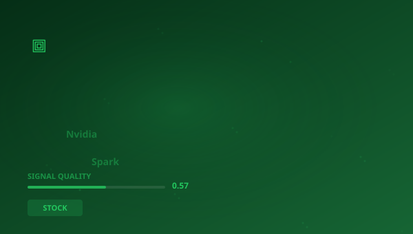

## 🔍 Trending (HackerNews, 2026-06-02)

1. [Nvidia RTX Spark](https://www.nvidia.com/en-us/products/rtx-spark/) ([discussion](https://news.ycombinator.com/item?id=48352939)) (405 pts)
2. [OpenAI frontier models and Codex are now available on AWS](https://openai.com/index/openai-frontier-models-and-codex-are-now-available-on-aws/) ([discussion](https://news.ycombinator.com/item?id=48363132)) (326 pts)
3. [ChatGPT for Google Sheets exfiltrates workbooks](https://www.promptarmor.com/resources/gpt-for-google-sheets-data-exfiltration) ([discussion](https://news.ycombinator.com/item?id=48349487)) (322 pts)
4. [Chipotlai Max](https://github.com/cyberpapiii/chipotlai-max) ([discussion](https://news.ycombinator.com/item?id=48363765)) (301 pts)
5. [Meta launches Instagram, Facebook, and WhatsApp subscriptions](https://techcrunch.com/2026/05/27/meta-officially-launches-instagram-facebook-and-whatsapp-subscriptions-with-more-to-come-including-ai-plans/) ([discussion](https://news.ycombinator.com/item?id=48347354)) (286 pts)
6. [Microsoft builds MacBook Pro rival with NVIDIA-powered Surface Laptop Ultra](https://www.windowslatest.com/2026/06/01/microsoft-builds-its-ultimate-macbook-pro-rival-with-the-nvidia-powered-surface-laptop-ultra/) ([discussion](https://news.ycombinator.com/item?id=48355720)) (254 pts)
7. [Florida sues OpenAI and Sam Altman over AI risks](https://www.politico.com/news/2026/06/01/openai-hit-with-florida-lawsuit-00944215) ([discussion](https://news.ycombinator.com/item?id=48358667)) (251 pts)

> **Summary**
>Today in Capital markets and semiconductor analysis, the top story is "**Nvidia RTX Spark**", which gathered 405 points on Hacker News -- nearly 3x higher than the average of other articles. This is a strong signal that the topic resonates broadly. Sources are diverse (5 categories) -- the topic cuts across different circles. Key numbers include: 4; 3; 1. Key entities: **NVIDIA**, **OpenAI**, **Meta**, **Google**. In the background: "OpenAI frontier models and Codex are now available on AWS", "ChatGPT for Google Sheets exfiltrates workbooks". Total: 30 articles with 3697 points. Average SQI (Signal Quality Index): 0.574. That's all for today -- more tomorrow.

## 📊 Analysis

**Key entities:** `NVIDIA` · `OpenAI` · `Meta` · `Google` · `Intel` · `Founders Fund`
**Key numbers:** 4 · 3 · 1 · 128
**From articles:**
- The fusion of NVIDIA AI and RTX graphics in a single chip redefines Windows PCs and delivers amazing creating, AI develo
- Today, OpenAI frontier models and Codex are generally available on AWS, opening a new path for millions of AWS customers
- Display of an interactive phishing pop-up Overwriting the entire GPT sidebar with an attacker-controlled chatbot interfa

### 🔗 Cross-pillar connections
- "Hackers Used Meta's AI Support Bot to Seize Instagram Accoun" has connections to **SCIENCE** (score: 4)
- "Tell HN: Meta's AI support feature allows Instagram accounts" has connections to **SCIENCE** (score: 9)

## 🧠 Bloom Taxonomy Questions
1. **Remembering**: Which domain does the article "Meta launches Instagram, Facebook, and WhatsApp subscription…" come from?
2. **Understanding**: Why is the article "Amazon Shuts Down Internal AI Leaderboard After Employees Ch…" relevant to STOCK?
3. **Applying**: How can concepts from the article "Tell HN: Meta's AI support feature allows Instagram accounts…" be applied in practice in STOCK?
4. **Analyzing**: Which of these articles comes from a other source?
5. **Evaluating**: What is the credibility level of the source arxiv.org?

## 📚 Flashcards
- **API**: Application Programming Interface
- **ARM**: Low-power processor architecture owned by SoftBank
- **ASIC**: Application-Specific Integrated Circuit
- **GPU**: Graphics Processing Unit
- **HN**: Hacker News — tech industry social platform
- **Intel**: World's largest x86 processor manufacturer
- **IPO**: Initial Public Offering
- **NVIDIA**: GPU manufacturer and AI computing leader

> 

## 🧪 Classification quality

Classification: 59% (1030/1742) | Pillar share: 3%

---
*Report generated 2026-06-02. Source: Algolia HN API. Classification: AcaciaFund NLP. SQI: 0.574.*
