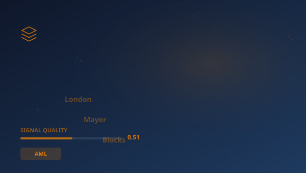

## 🔍 Trending (HackerNews, 2026-05-23)

1. [London Mayor Blocks Palantir](https://www.theguardian.com/uk-news/2026/may/21/london-mayor-sadiq-khan-blocks-met-police-deal-with-palantir) ([dyskusja](https://news.ycombinator.com/item?id=48225489)) (pkt 194)
2. [CODA: Rewriting Transformer Blocks as GEMM-Epilogue Programs](https://arxiv.org/abs/2605.19269) ([dyskusja](https://news.ycombinator.com/item?id=48232118)) (pkt 103)
3. [Spanish Court Declines to Fine NordVPN over LaLiga Piracy Blocking Order](https://torrentfreak.com/spanish-court-declines-to-fine-nordvpn-over-laliga-piracy-blocking-order/) ([dyskusja](https://news.ycombinator.com/item?id=48245362)) (pkt 71)
4. [FSFE intervenes against Apple before EUCJ for the second time](https://fsfe.org/news/2026/news-20260519-01.en.html) ([dyskusja](https://news.ycombinator.com/item?id=48233939)) (pkt 65)
5. [AI keeps inventing fake cases. Lawyers keep citing them](https://www.scientificamerican.com/article/why-lawyers-keep-citing-fake-cases-invented-by-ai/) ([dyskusja](https://news.ycombinator.com/item?id=48241179)) (pkt 60)
6. [Waymo expands pause to four cities as robotaxis keep driving into floods](https://techcrunch.com/2026/05/21/waymo-pauses-service-in-four-cities-as-robotaxis-keep-driving-into-floods/) ([dyskusja](https://news.ycombinator.com/item?id=48240331)) (pkt 54)
7. [Bun's unreleased Rust port has 13,365 unsafe blocks](https://bun.com/bun-unsafe-audit) ([dyskusja](https://news.ycombinator.com/item?id=48239790)) (pkt 51)

> **Podsumowanie**
>Dzisiaj w obszarze Ewolucja systemów odpornościowych w sektorze finansowym uwagę przykuwa przede wszystkim "**London Mayor Blocks Palantir**", który zebrał 194 pkt na Hacker News -- wynik blisko 7x wyższy od średniej pozostałych artykułów. To silny sygnał, że temat rezonuje szerzej. Źródła są zróżnicowane (5 kategorii) -- temat przebija się przez różne kręgi. Wśród kluczowych liczb pojawiają się: 50; 330; 240. Główne podmioty: **SEC**, **Block**, **Free Software**, **Fed**. W tle: "CODA: Rewriting Transformer Blocks as GEMM-Epilogue Programs", "Spanish Court Declines to Fine NordVPN over LaLiga Piracy Blocking...". Łącznie 30 artykułów o wartości 801 pkt. Średni SQI (Signal Quality Index): 0.512. To tyle na dziś -- więcej jutro.

## 📊 Analiza

**Kluczowe podmioty:** `SEC` · `Block` · `Free Software` · `Fed` · `European Commission` · `Apple`
**Kluczowe liczby:** 50 · 330 · 240 · 15
**Z artykułów:**
- London mayor’s decision as disappointing and warns it could hit policing Sadiq Khan has blocked a £50mMetropolitan polic
- XivLabs is a framework that allows collaborators to develop and share new arXiv features directly on our website.
- LaLiga, in its turn, pointed out that NordVPN failed to fully implement the Spanish interim order, and it asked the cour

### 🔗 Połączenia międzyfilarowe
- "The efficiency-gain illusion: People underestimate the rate " ma powiązania z **SCIENCE** (punkty: 6)

## 🧠 Pytania Bloom Taxonomy
1. **Zapamiętywanie**: Z jakiej domeny pochodzi artykuł "Brazil bans stablecoin and crypto settlement in cross-border…"?
2. **Rozumienie**: Dlaczego artykuł "Department of War Publishes Second Release of UAP Files" jest istotny w obszarze AML?
3. **Stosowanie**: Jak koncepcje z artykułu "Second tranch of UFO files declassified" można zastosować w praktyce w AML?
4. **Analiza**: Który z tych artykułów pochodzi ze źródła edukacyjne/rządowe?

## 📚 Fiszki
- **ARM**: Architektura procesorów o niskim poborze energii, własność SoftBank
- **Binance**: Największa giełda kryptowalut na świecie
- **CTF**: Counter-Terrorism Financing — przeciwdziałanie finansowaniu terroryzmu
- **EBA**: European Banking Authority — Europejski Urząd Nadzoru Bankowego
- **Fed**: Federal Reserve System — bank centralny Stanów Zjednoczonych
- **HN**: Hacker News — platforma społecznościowa dla branży technologicznej
- **MIT**: Massachusetts Institute of Technology
- **SEC**: Securities and Exchange Commission — amerykański regulator rynku papierów wartościowych

> 

## 🧪 Jakosc klasyfikacji

Klasyfikacja: 58% (1030/1763) | Udział filara: 3%

---
*Raport wygenerowano 2026-05-23. Zrodlo: Algolia HN API. Klasyfikacja: AcaciaFund NLP. SQI: 0.512.*
