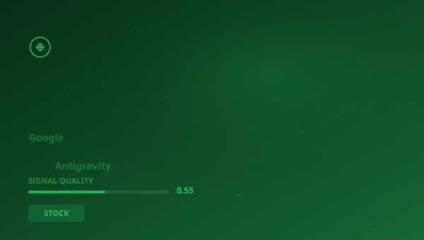

## 🔍 Trending (HackerNews, 2026-05-23)

1. [Google's Antigravity bait and switch](https://www.0xsid.com/blog/antigravity-bait-n-switch) ([dyskusja](https://news.ycombinator.com/item?id=48222529)) (pkt 753)
2. [Steve Wozniak cheered after telling students they have AI – actual intelligence](https://www.businessinsider.com/steve-wozniak-apple-ai-graduation-speech-2026-5) ([dyskusja](https://news.ycombinator.com/item?id=48233563)) (pkt 629)
3. [Seattle Shield, an intelligence-sharing network operated by the Seattle police](https://prismreports.org/2026/05/20/seattle-shield-private-companies-surveillance/) ([dyskusja](https://news.ycombinator.com/item?id=48226588)) (pkt 483)
4. [Antigravity 2.0 Tops the OpenSCAD Architectural 3D LLM Benchmark](https://modelrift.com/blog/openscad-llm-benchmark/) ([dyskusja](https://news.ycombinator.com/item?id=48234090)) (pkt 395)
5. [Microsoft starts canceling Claude Code licenses](https://www.theverge.com/tech/930447/microsoft-claude-code-discontinued-notepad) ([dyskusja](https://news.ycombinator.com/item?id=48238896)) (pkt 326)
6. [Samsung chip workers will get an average $340k bonus as AI profits soar](https://qz.com/samsung-chip-workers-bonus-ai-profits-052126) ([dyskusja](https://news.ycombinator.com/item?id=48230892)) (pkt 249)
7. [SpaceX launches Starship v3 rocket](https://www.nbcnews.com/now/video/spacex-successfully-launches-prototype-of-starship-rocket-263835205505) ([dyskusja](https://news.ycombinator.com/item?id=48242959)) (pkt 237)

> **Podsumowanie**
>Dzisiaj w obszarze Analiza rynków kapitałowych i półprzewodników uwagę przykuwa przede wszystkim "**Google's Antigravity bait and switch**", który zebrał 753 pkt na Hacker News -- wynik blisko 5x wyższy od średniej pozostałych artykułów. To silny sygnał, że temat rezonuje szerzej. Źródła są zróżnicowane (4 kategorii) -- temat przebija się przez różne kręgi. Wśród kluczowych liczb pojawiają się: 2026,; 2.; 2009.. Główne podmioty: **Google**, **Microsoft**, **Intel**, **Seattle Police Department**. W tle: "Steve Wozniak cheered after telling students they have AI – actual...", "Seattle Shield, an intelligence-sharing network operated by the...". Łącznie 30 artykułów o wartości 4126 pkt. Średni SQI (Signal Quality Index): 0.549. To tyle na dziś -- więcej jutro.

## 📊 Analiza

**Kluczowe podmioty:** `Google` · `Microsoft` · `Intel` · `Seattle Police Department` · `Meta` · `Grand Valley State University`
**Kluczowe liczby:** 2026, · 2. · 2009. · 2020.
**Z artykułów:**
- Before I launched it, Antigravity had automatically "updated" my existing installation to the new one and, in the proces
- During his speech, Wozniak offered reassurance to new graduates who are entering the workforce at the height of the AI r
- In Seattle, Facebook, Amazon, real estate management, and Immigration and Customs Enforcement (ICE) all share one thing 

## 🧠 Pytania Bloom Taxonomy
1. **Zapamiętywanie**: Z jakiej domeny pochodzi artykuł "Google's Antigravity bait and switch"?
2. **Rozumienie**: Jakiego typu jest domena zeroshot.bearblog.dev?
3. **Stosowanie**: Jak koncepcje z artykułu "Israel's High-Tech Campaign to Kill or Capture Every Oct. 7 …" można zastosować w praktyce w STOCK?
4. **Analiza**: Który z tych artykułów pochodzi ze źródła edukacyjne/rządowe?
5. **Ewaluacja**: Jaki jest poziom wiarygodności źródła wsj.com?

## 📚 Fiszki
- **API**: Application Programming Interface — interfejs programistyczny aplikacji
- **Intel**: Największy producent procesorów x86 na świecie
- **IPO**: Initial Public Offering — pierwsza oferta publiczna akcji
- **LLM**: Large Language Model — duży model językowy
- **NVIDIA**: Producent procesorów graficznych (GPU) i lider w AI computing
- **Samsung**: Konglomerat technologiczny, największy producent pamięci
- **SPAC**: Special Purpose Acquisition Company — spółka celowa przejęć
- **WHO**: World Health Organization — Światowa Organizacja Zdrowia

> 

## 🧪 Jakosc klasyfikacji

Klasyfikacja: 58% (1030/1763) | Udział filara: 3%

---
*Raport wygenerowano 2026-05-23. Zrodlo: Algolia HN API. Klasyfikacja: AcaciaFund NLP. SQI: 0.549.*
