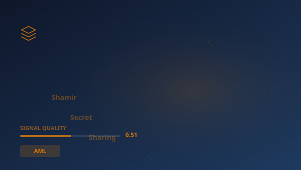

## 🔍 Trending (HackerNews, 2026-05-26)

1. [How Shamir's Secret Sharing Works](https://ente.com/blog/how-shamirs-secret-sharing-works/) ([dyskusja](https://news.ycombinator.com/item?id=48272715)) (pkt 307)
2. [Netherlands blocks US takeover of vital digital supplier](https://www.politico.eu/article/netherlands-blocks-us-takeover-vital-digital-supplier/) ([dyskusja](https://news.ycombinator.com/item?id=48278406)) (pkt 274)
3. [DynIP – Dynamic DNS with RFC 2136, IPv6, DNSSEC, and BYOD](https://dynip.dev/) ([dyskusja](https://news.ycombinator.com/item?id=48276363)) (pkt 235)
4. [Spain blocks prediction markets Polymarket, Kalshi over lack of gambling licence](https://www.reuters.com/business/spain-blocks-prediction-markets-polymarket-kalshi-over-lack-gambling-licences-2026-05-26/) ([dyskusja](https://news.ycombinator.com/item?id=48279316)) (pkt 138)
5. [2026 HIPAA Security Rule Update](https://medcurity.com/hipaa-security-rule-2026-update/) ([dyskusja](https://news.ycombinator.com/item?id=48266895)) (pkt 97)
6. [D. Trump Jr. and Eric Trump Running Felony Fraud Scheme Prosecutable in New York](https://cmarmitage.substack.com/p/donald-trump-jr-and-eric-trump-are) ([dyskusja](https://news.ycombinator.com/item?id=48262841)) (pkt 64)
7. [Hawaii just found a way around Citizens United. Other states are following](https://www.ms.now/ali-velshi/watch/hawaii-just-found-a-way-around-citizens-united-other-states-are-following-2501173315542) ([dyskusja](https://news.ycombinator.com/item?id=48270716)) (pkt 50)

> **Podsumowanie**
>Dzisiaj w obszarze Ewolucja systemów odpornościowych w sektorze finansowym uwagę przykuwa przede wszystkim "**How Shamir's Secret Sharing Works**", który zebrał 307 pkt na Hacker News -- wynik blisko 6x wyższy od średniej pozostałych artykułów. To silny sygnał, że temat rezonuje szerzej. Źródła są zróżnicowane (3 kategorii) -- temat przebija się przez różne kręgi. Wśród kluczowych liczb pojawiają się: 1979.; 1.; 60. Główne podmioty: **SEC**, **Citi**, **Block**, **EBA**. W tle: "Netherlands blocks US takeover of vital digital supplier", "DynIP – Dynamic DNS with RFC 2136, IPv6, DNSSEC, and BYOD". Łącznie 26 artykułów o wartości 1402 pkt. Średni SQI (Signal Quality Index): 0.511. To tyle na dziś -- więcej jutro.

## 📊 Analiza

**Kluczowe podmioty:** `SEC` · `Citi` · `Block` · `EBA` · `State Secretary` · `Digital Economy Willemijn Aerdts`
**Kluczowe liczby:** 1979. · 1. · 60 · 2136
**Z artykułów:**
- Some secrets are too important to trust to one person, and too important to lose if that person disappears.
- Dutch firm Solvinity runs a platform for the country's DigiD app, which allows the country's citizens to authenticate th
- TTL · NOTIFY-driven · Multi-region nameservers RFC 2136 TSIG means your FortiGate, MikroTik, OPNsense, OpenWRT, or any r

### 🔗 Połączenia międzyfilarowe
- "Association between serum cotinine levels and cognitive func" ma powiązania z **STOCK** (punkty: 4)

## 🧠 Pytania Bloom Taxonomy
1. **Zapamiętywanie**: Z jakiej domeny pochodzi artykuł "WebAssembly 128-bit packed SIMD Extension"?
2. **Rozumienie**: Jakiego typu jest domena github.com?
3. **Analiza**: Który z tych artykułów pochodzi ze źródła edukacyjne/rządowe?
4. **Ewaluacja**: Jaki jest poziom wiarygodności źródła reuters.com?

## 📚 Fiszki
- **AML**: Anti-Money Laundering — przeciwdziałanie praniu pieniędzy
- **ARM**: Architektura procesorów o niskim poborze energii, własność SoftBank
- **EBA**: European Banking Authority — Europejski Urząd Nadzoru Bankowego
- **HN**: Hacker News — platforma społecznościowa dla branży technologicznej
- **OCC**: Office of the Comptroller of the Currency — amerykański nadzór bankowy
- **PoC**: Proof of Concept — dowód koncepcji
- **SEC**: Securities and Exchange Commission — amerykański regulator rynku papierów wartościowych
- **Secret Sharing**: Temat z artykułu: How Shamir's Secret Sharing Works

> 

## 🧪 Jakosc klasyfikacji

Klasyfikacja: 57% (1026/1785) | Udział filara: 3%

---
*Raport wygenerowano 2026-05-26. Zrodlo: Algolia HN API. Klasyfikacja: AcaciaFund NLP. SQI: 0.511.*
