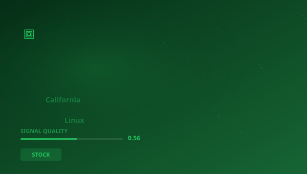

## 🔍 Trending (HackerNews, 2026-05-26)

1. [California moves to exempt Linux from its age-verification law after backlash](https://www.tomshardware.com/software/linux/california-moves-to-exempt-linux-from-its-upcoming-age-verification-law-after-backlash-over-forcing-operating-systems-to-collect-users-ages-amendment-proposed-by-the-same-lawmaker-who-wrote-the-original-law) ([dyskusja](https://news.ycombinator.com/item?id=48269961)) (pkt 1000)
2. [Search engines alternatives now that Google isn't Google anymore](https://techcrunch.com/2026/05/21/six-search-engines-worth-trying-now-that-google-isnt-really-google-anymore/) ([dyskusja](https://news.ycombinator.com/item?id=48266051)) (pkt 554)
3. [Memory has grown to nearly two-thirds of AI chip component costs](https://epoch.ai/data-insights/ai-chip-component-cost-shares) ([dyskusja](https://news.ycombinator.com/item?id=48258684)) (pkt 440)
4. [Motorola phones have started hijacking the Amazon app to insert affiliate codes](https://9to5google.com/2026/05/25/motorola-amazon-app-hijacking-behavior/) ([dyskusja](https://news.ycombinator.com/item?id=48274794)) (pkt 323)
5. [Microsoft Copilot Cowork Exfiltrates Files](https://www.promptarmor.com/resources/microsoft-copilot-cowork-exfiltrates-files) ([dyskusja](https://news.ycombinator.com/item?id=48272354)) (pkt 251)
6. [Microsoft pulls plug on plans for 244-acre data center in Caledonia (2025)](https://www.tmj4.com/news/racine-county/microsoft-pulls-plug-on-plans-for-244-acre-data-center-in-caledonia-after-community-pushback) ([dyskusja](https://news.ycombinator.com/item?id=48266422)) (pkt 179)
7. [CVE-2026-28952: Apple macOS 26.5 Kernel Vuln found by Claude](https://support.apple.com/en-us/127115) ([dyskusja](https://news.ycombinator.com/item?id=48273169)) (pkt 159)

> **Podsumowanie**
>Dzisiaj w obszarze Analiza rynków kapitałowych i półprzewodników uwagę przykuwa przede wszystkim "**California moves to exempt Linux from its age-verification law after backlash**", który zebrał 1000 pkt na Hacker News -- wynik blisko 9x wyższy od średniej pozostałych artykułów. To silny sygnał, że temat rezonuje szerzej. Źródła są zróżnicowane (4 kategorii) -- temat przebija się przez różne kręgi. Wśród kluczowych liczb pojawiają się: 1,; 2027.; 1043. Główne podmioty: **Digital Age Assurance Act**, **Google**, **Meta**, **Microsoft**. W tle: "Search engines alternatives now that Google isn't Google anymore", "Memory has grown to nearly two-thirds of AI chip component costs". Łącznie 30 artykułów o wartości 3515 pkt. Średni SQI (Signal Quality Index): 0.559. To tyle na dziś -- więcej jutro.

## 📊 Analiza

**Kluczowe podmioty:** `Digital Age Assurance Act` · `Google` · `Meta` · `Microsoft` · `Apple` · `Electronic Frontier Foundation`
**Kluczowe liczby:** 1, · 2027. · 1043 · 1043
**Z artykułów:**
- California’s legislature ahead of committee reviews in June, would amend the state’s earlier age-assurance law by exclud
- Instead, many users see this as yet another example of a tech company squeezing AI agents and chatbots into everything i
- In absolute terms, HBM spend across these four designers grew from roughly $12 billion in 2024 to $32 billion in 2025, a

### 🔗 Połączenia międzyfilarowe
- "Systemic inflammation mediates the link between cardiometabo" ma powiązania z **AML** (punkty: 4)

## 🧠 Pytania Bloom Taxonomy
1. **Zapamiętywanie**: Jaka organizacja/instytucja jest głównym tematem artykułu "California moves to exempt Linux from its age-verification l…"?
2. **Rozumienie**: Jakiego typu jest domena github.com?
3. **Analiza**: Który z tych artykułów pochodzi ze źródła edukacyjne/rządowe?
4. **Ewaluacja**: Jaki jest poziom wiarygodności źródła pubmed.ncbi.nlm.nih.gov?

## 📚 Fiszki
- **ARM**: Architektura procesorów o niskim poborze energii, własność SoftBank
- **ASIC**: Application-Specific Integrated Circuit — układ scalony dedykowanego zastosowania
- **HN**: Hacker News — platforma społecznościowa dla branży technologicznej
- **Intel**: Największy producent procesorów x86 na świecie
- **PoC**: Proof of Concept — dowód koncepcji
- **RISC-V**: Otwarta architektura procesorów
- **SAR**: Suspicious Activity Report — zgłoszenie podejrzanej aktywności
- **SPAC**: Special Purpose Acquisition Company — spółka celowa przejęć

> 

## 🧪 Jakosc klasyfikacji

Klasyfikacja: 58% (1030/1789) | Udział filara: 3%

---
*Raport wygenerowano 2026-05-26. Zrodlo: Algolia HN API. Klasyfikacja: AcaciaFund NLP. SQI: 0.559.*
