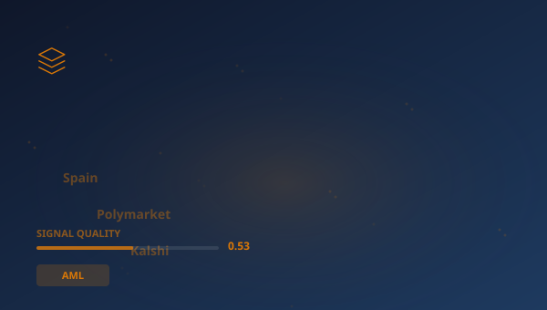

## 🔍 Trending (HackerNews, 2026-05-27)

1. [Spain blocks prediction markets Polymarket, Kalshi over lack of gambling licence](https://www.reuters.com/business/spain-blocks-prediction-markets-polymarket-kalshi-over-lack-gambling-licences-2026-05-26/) ([dyskusja](https://news.ycombinator.com/item?id=48279316)) (pkt 843)
2. [Netherlands blocks US takeover of vital digital supplier](https://www.politico.eu/article/netherlands-blocks-us-takeover-vital-digital-supplier/) ([dyskusja](https://news.ycombinator.com/item?id=48278406)) (pkt 543)
3. [How Shamir's Secret Sharing Works](https://ente.com/blog/how-shamirs-secret-sharing-works/) ([dyskusja](https://news.ycombinator.com/item?id=48272715)) (pkt 375)
4. [DynIP – Dynamic DNS with RFC 2136, IPv6, DNSSEC, and BYOD](https://dynip.dev/) ([dyskusja](https://news.ycombinator.com/item?id=48276363)) (pkt 321)
5. [A few interesting modern pixel fonts](https://unsung.aresluna.org/a-few-interesting-modern-pixel-fonts/) ([dyskusja](https://news.ycombinator.com/item?id=48271448)) (pkt 304)
6. [Stripe is friendly to “friendly fraud”](https://www.gingerlime.com/2026/stripe-seem-friendly-to-friendly-fraud/) ([dyskusja](https://news.ycombinator.com/item?id=48287982)) (pkt 191)
7. [2026 HIPAA Security Rule Update](https://medcurity.com/hipaa-security-rule-2026-update/) ([dyskusja](https://news.ycombinator.com/item?id=48266895)) (pkt 98)

> **Podsumowanie**
>Dzisiaj w obszarze Ewolucja systemów odpornościowych w sektorze finansowym uwagę przykuwa przede wszystkim "**Spain blocks prediction markets Polymarket, Kalshi over lack of gambling licence**", który zebrał 843 pkt na Hacker News -- wynik blisko 9x wyższy od średniej pozostałych artykułów. To silny sygnał, że temat rezonuje szerzej. Źródła są zróżnicowane (4 kategorii) -- temat przebija się przez różne kręgi. Wśród kluczowych liczb pojawiają się: 1979.; 1.; 60. Główne podmioty: **SEC**, **Block**, **EBA**, **State Secretary**. W tle: "Netherlands blocks US takeover of vital digital supplier", "How Shamir's Secret Sharing Works". Łącznie 30 artykułów o wartości 2964 pkt. Średni SQI (Signal Quality Index): 0.530. To tyle na dziś -- więcej jutro.

## 📊 Analiza

**Kluczowe podmioty:** `SEC` · `Block` · `EBA` · `State Secretary` · `Digital Economy Willemijn Aerdts` · `European Commission`
**Kluczowe liczby:** 1979. · 1. · 60 · 2136
**Z artykułów:**
- Dutch firm Solvinity runs a platform for the country's DigiD app, which allows the country's citizens to authenticate th
- Some secrets are too important to trust to one person, and too important to lose if that person disappears.
- TTL · NOTIFY-driven · Multi-region nameservers RFC 2136 TSIG means your FortiGate, MikroTik, OPNsense, OpenWRT, or any r

## 🧠 Pytania Bloom Taxonomy
1. **Zapamiętywanie**: Z jakiej domeny pochodzi artykuł "NL govt blocks DigiD takeover by solvinity"?
2. **Rozumienie**: Jakiego typu jest domena arxiv.org?
3. **Stosowanie**: Jak koncepcje z artykułu "Steve Jobs in Exile: NeXT and the Making of a Comeback [vide…" można zastosować w praktyce w AML?
4. **Analiza**: Który z tych artykułów pochodzi ze źródła newsowe?
5. **Ewaluacja**: Jaki jest poziom wiarygodności źródła arxiv.org?

## 📚 Fiszki
- **AML**: Anti-Money Laundering — przeciwdziałanie praniu pieniędzy
- **Anthropic**: Firma AI tworząca model Claude
- **API**: Application Programming Interface — interfejs programistyczny aplikacji
- **EBA**: European Banking Authority — Europejski Urząd Nadzoru Bankowego
- **Fed**: Federal Reserve System — bank centralny Stanów Zjednoczonych
- **OCC**: Office of the Comptroller of the Currency — amerykański nadzór bankowy
- **PoC**: Proof of Concept — dowód koncepcji
- **SEC**: Securities and Exchange Commission — amerykański regulator rynku papierów wartościowych

> 

## 🧪 Jakosc klasyfikacji

Klasyfikacja: 58% (1030/1771) | Udział filara: 3%

---
*Raport wygenerowano 2026-05-27. Zrodlo: Algolia HN API. Klasyfikacja: AcaciaFund NLP. SQI: 0.530.*
