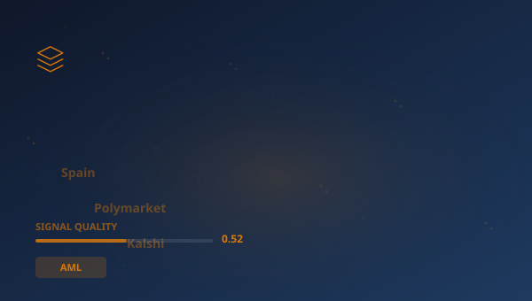

## 🔍 Trending (HackerNews, 2026-05-28)

1. [Spain blocks prediction markets Polymarket, Kalshi over lack of gambling licence](https://www.reuters.com/business/spain-blocks-prediction-markets-polymarket-kalshi-over-lack-gambling-licences-2026-05-26/) ([dyskusja](https://news.ycombinator.com/item?id=48279316)) (pkt 1071)
2. [Netherlands blocks US takeover of vital digital supplier](https://www.politico.eu/article/netherlands-blocks-us-takeover-vital-digital-supplier/) ([dyskusja](https://news.ycombinator.com/item?id=48278406)) (pkt 593)
3. [Stripe is friendly to “friendly fraud”](https://www.gingerlime.com/2026/stripe-seem-friendly-to-friendly-fraud/) ([dyskusja](https://news.ycombinator.com/item?id=48287982)) (pkt 313)
4. [I found a second vote.gov – and it's registered to the White House](https://thedreydossier.substack.com/p/i-found-a-second-votegov-and-its) ([dyskusja](https://news.ycombinator.com/item?id=48298665)) (pkt 194)
5. [The VibeSec Reckoning](https://martinfowler.com/articles/vibesec-reckoning.html) ([dyskusja](https://news.ycombinator.com/item?id=48294670)) (pkt 61)
6. [Coalton is an efficient, statically typed Lisp with ideas from Haskell and OCaml](https://coalton-lang.github.io/) ([dyskusja](https://news.ycombinator.com/item?id=48280451)) (pkt 40)
7. [Pentagon puts building blocks in place for Cuba invasion](https://www.politico.com/news/2026/05/27/cuba-us-military-attack-00938740) ([dyskusja](https://news.ycombinator.com/item?id=48303594)) (pkt 31)

> **Podsumowanie**
>Dzisiaj w obszarze Ewolucja systemów odpornościowych w sektorze finansowym uwagę przykuwa przede wszystkim "**Spain blocks prediction markets Polymarket, Kalshi over lack of gambling licence**", który zebrał 1071 pkt na Hacker News -- wynik blisko 13x wyższy od średniej pozostałych artykułów. To silny sygnał, że temat rezonuje szerzej. Źródła są zróżnicowane (5 kategorii) -- temat przebija się przez różne kręgi. Wśród kluczowych liczb pojawiają się: 2025.; 3161,; 10,000. Główne podmioty: **Block**, **SEC**, **Global Marketing**, **The National Design Studio**. W tle: "Netherlands blocks US takeover of vital digital supplier", "Stripe is friendly to “friendly fraud”". Łącznie 30 artykułów o wartości 2513 pkt. Średni SQI (Signal Quality Index): 0.517. To tyle na dziś -- więcej jutro.

## 📊 Analiza

**Kluczowe podmioty:** `Block` · `SEC` · `Global Marketing` · `The National Design Studio` · `National Design Studio` · `Citi`
**Kluczowe liczby:** 2025. · 3161, · 10,000
**Z artykułów:**
- Dutch firm Solvinity runs a platform for the country's DigiD app, which allows the country's citizens to authenticate th
- The customer didn’t contact to request a refund or a re-delivery, but I saw a dispute filed, so I reached out to them.
- If you have not been to TrumpRx, it is a federal drug pricing website that looks like Wix and a Pinterest board threw up

### 🔗 Połączenia międzyfilarowe
- "Steve Jobs in Exile: NeXT and the Making of a Comeback [vide" ma powiązania z **STOCK** (punkty: 6)

## 🧠 Pytania Bloom Taxonomy
1. **Zapamiętywanie**: Z jakiej domeny pochodzi artykuł "Execution and assessment of agentic influence operations in …"?
2. **Rozumienie**: Jakiego typu jest domena opensource.posit.co?
3. **Stosowanie**: Jak koncepcje z artykułu "Execution and assessment of agentic influence operations in …" można zastosować w praktyce w AML?
4. **Analiza**: Który z tych artykułów pochodzi ze źródła inne?
5. **Ewaluacja**: Jaki jest poziom wiarygodności źródła arxiv.org?

## 📚 Fiszki
- **AML**: Anti-Money Laundering — przeciwdziałanie praniu pieniędzy
- **EBA**: European Banking Authority — Europejski Urząd Nadzoru Bankowego
- **Fed**: Federal Reserve System — bank centralny Stanów Zjednoczonych
- **HN**: Hacker News — platforma społecznościowa dla branży technologicznej
- **LLM**: Large Language Model — duży model językowy
- **SAR**: Suspicious Activity Report — zgłoszenie podejrzanej aktywności
- **SEC**: Securities and Exchange Commission — amerykański regulator rynku papierów wartościowych
- **Stripe**: Platforma obsługi płatności internetowych

> 

## 🧪 Jakosc klasyfikacji

Klasyfikacja: 58% (1030/1778) | Udział filara: 3%

---
*Raport wygenerowano 2026-05-28. Zrodlo: Algolia HN API. Klasyfikacja: AcaciaFund NLP. SQI: 0.517.*
