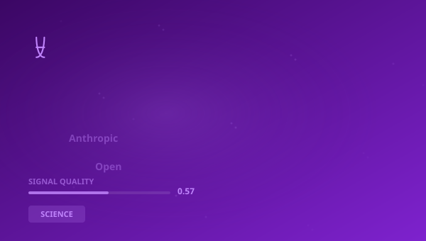

## 🔍 Trending (HackerNews, 2026-05-28)

1. [I think Anthropic and OpenAI have found product-market fit](https://simonwillison.net/2026/May/27/product-market-fit/) ([dyskusja](https://news.ycombinator.com/item?id=48296794)) (pkt 835)
2. [That Methyl Methacrylate Tank](https://www.science.org/content/blog-post/methyl-methacrylate-tank) ([dyskusja](https://news.ycombinator.com/item?id=48284712)) (pkt 423)
3. [All of human cooking compressed into 2 megabytes](https://arxiv.org/abs/2605.22391) ([dyskusja](https://news.ycombinator.com/item?id=48291225)) (pkt 407)
4. [A sleep-like consolidation mechanism for LLMs](https://arxiv.org/abs/2605.26099) ([dyskusja](https://news.ycombinator.com/item?id=48281226)) (pkt 210)
5. [AWS Fired the One Employee Who Gave a Damn](https://www.seuros.com/blog/aws-fired-the-human-who-made-the-difference/) ([dyskusja](https://news.ycombinator.com/item?id=48279321)) (pkt 196)
6. [Stop Advertising in Your Commits](https://akselmo.dev/posts/stop-advertising-in-your-commits/) ([dyskusja](https://news.ycombinator.com/item?id=48283914)) (pkt 189)
7. [Stress disrupts hippocampal integration of overlapping events, memory inference](https://www.science.org/doi/10.1126/sciadv.aea5496?user_id=66c4bf745d78644b3aa57b08) ([dyskusja](https://news.ycombinator.com/item?id=48296622)) (pkt 119)

> **Podsumowanie**
>Dzisiaj w obszarze Nauka, systemy złożone i ewolucja poznawcza uwagę przykuwa przede wszystkim "**I think Anthropic and OpenAI have found product-market fit**", który zebrał 835 pkt na Hacker News -- wynik blisko 9x wyższy od średniej pozostałych artykułów. To silny sygnał, że temat rezonuje szerzej. Źródła są zróżnicowane (4 kategorii) -- temat przebija się przez różne kręgi. Wśród kluczowych liczb pojawiają się: 2025; 20; 14,. Główne podmioty: **MIT**, **OpenAI**, **WHO**, **NASA**. W tle: "That Methyl Methacrylate Tank", "All of human cooking compressed into 2 megabytes". Łącznie 30 artykułów o wartości 2703 pkt. Średni SQI (Signal Quality Index): 0.570. To tyle na dziś -- więcej jutro.

## 📊 Analiza

**Kluczowe podmioty:** `MIT` · `OpenAI` · `WHO` · `NASA` · `Anthropic` · `Meta`
**Kluczowe liczby:** 2025 · 20 · 14, · 2026,
**Z artykułów:**
- Storiesare circulatingof companies surprised at how expensive their LLM bills are becoming from usage by their staff.
- People wrote to me to ask ifmethyl methacrylate itselfis on my “Things I Won’t Work With” list, but it’s a long way from
- XivLabs is a framework that allows collaborators to develop and share new arXiv features directly on our website.

### 🔗 Połączenia międzyfilarowe
- "OpenAI and Anthropic dig in against each other on AI jobs ap" ma powiązania z **STOCK** (punkty: 6)

## 🧠 Pytania Bloom Taxonomy
1. **Zapamiętywanie**: Z jakiej domeny pochodzi artykuł "BIRDNet: Mining and Encoding Boolean Implication Knowledge G…"?
2. **Rozumienie**: Jakiego typu jest domena pnas.org?
3. **Stosowanie**: Jak koncepcje z artykułu "Jumping Spiders Seem to Dream" można zastosować w praktyce w SCIENCE?
4. **Analiza**: Który z tych artykułów pochodzi ze źródła inne?
5. **Ewaluacja**: Jaki jest poziom wiarygodności źródła yourlifeunderrome.com?
6. **Tworzenie**: Na podstawie artykułów z SCIENCE, zaproponuj nowy kierunek badań lub projekt inspirowany tematem "China".

## 📚 Fiszki
- **Anthropic**: Firma AI tworząca model Claude
- **HN**: Hacker News — platforma społecznościowa dla branży technologicznej
- **LLM**: Large Language Model — duży model językowy
- **MIT**: Massachusetts Institute of Technology
- **NASA**: National Aeronautics and Space Administration — amerykańska agencja kosmiczna
- **OpenAI**: OpenAI — organizacja badawcza AI, twórca GPT
- **PoC**: Proof of Concept — dowód koncepcji
- **SPAC**: Special Purpose Acquisition Company — spółka celowa przejęć

> 

## 🧪 Jakosc klasyfikacji

Klasyfikacja: 58% (1030/1778) | Udział filara: 3%

---
*Raport wygenerowano 2026-05-28. Zrodlo: Algolia HN API. Klasyfikacja: AcaciaFund NLP. SQI: 0.570.*
