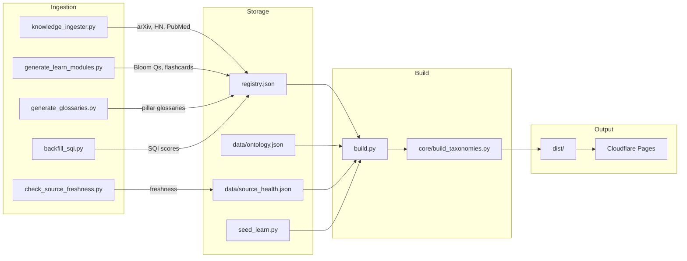

# Data Flow

The end-to-end data flow from content ingestion through build to deployment.

## Pipeline Overview



## Detailed Flow

### 1. Ingestion (Scripts Layer)

| Script | Input | Output | Frequency |
|--------|-------|--------|-----------|
| `knowledge_ingester.py` | arXiv API, HN API, PubMed | `registry.json` updates | On demand |
| `generate_learn_modules.py` | Registry items + `seed_learn.py` | Learn module content in registry | On demand |
| `generate_glossaries.py` | Ontology concepts | Glossary pages in registry | After ontology changes |
| `backfill_sqi.py` | Registry items (missing SQI) | Computed SQI scores in registry | On demand |
| `check_source_freshness.py` | 32 inspiration sources from `etc/pillars.toml` | `data/source_health.json` | Weekly (Mon 04:00) |
| `source_synthesis.py` | Registry + inspiration sources | Source synthesis data | Weekly |
| `source_verification.py` | Synthesis data | Verified source metadata | Weekly |

### 2. Registry (`registry.json`)

Central JSON file (195 items — 96 research, 83 learn, 16 knowledge) validated against `schemas.py:RegistryData`. Each item has:
- Slug (internal key format)
- Content metadata (title, description, author, date)
- Body HTML
- Taxonomy fields (pillar, content_type, category, tags)
- Quality signals (SQI)

**Locking:** `registry.json.lock` prevents concurrent writes.

### 3. Build (`build.py`)

The build executes in ordered phases:

```
1. Load registry      → Parse + validate registry.json
2. Build cache init   → Load .build_cache.json for incremental builds
3. Process each item  → Render HTML through Jinja2 templates
4. Generate taxonomy  → admin pages, search index, tag pages, pillar pages, feed
5. Build graph        → Generate graph-data.json
6. Copy static assets → CSS, JS, images
7. Write metadata     → build-meta.json, build_errors.log
```

### 4. Output (`dist/`)

| Artifact | Description |
|----------|-------------|
| `{pillar_url}/{content_type}/{topic}/index.html` | Content pages |
| `admin/*.html` | 12 admin dashboard pages |
| `static/` | Static assets (CSS, JS, images) |
| `search-index.json` | Client-side search index |
| `graph-data.json` | Cytoscape knowledge graph data |
| `feed.xml` | Atom feed |
| `build-meta.json` | Build metrics and metadata |
| `build_errors.log` | Build error log (0 bytes = clean) |
| `_redirects` | Cloudflare Pages redirect rules |

### 5. Deployment

- **Production:** Cloudflare Pages at `https://www.acaciafund.org/`
- **Trigger:** `python3 scripts/deploy_cloudflare.py` (sends `workflow_dispatch` to GitHub Actions)
- **Weekly auto-refresh:** Monday 04:00 UTC via `.github/workflows/source-refresh.yml`
  - 1: Regenerate ontology, glossaries, source synthesis
  - 2: Check source freshness (32 sources)
  - 3: Full rebuild
  - 4: Links check + SQI audit
  - 5: Upload artifacts (30-day retention)
  - 6: Commit `data/ontology.json`, `registry.json`, `data/source_health.json`

## Script Dependency Graph

```
knowledge_ingester.py
  ├── config.py (PILLAR_URL_MAP, PILLAR_SUBCATEGORIES)
  ├── core/ontology.py (extract_concepts_from_text)
  └── core/urls.py (slug helpers)

build.py
  ├── config.py (all constants)
  ├── core/build_taxonomies.py (5 generators)
  ├── core/build_cache.py (incremental)
  ├── core/ontology.py (concept extraction)
  ├── core/urls.py (slug translation)
  ├── core/visuals.py (images, icons)
  ├── core/assets.py (asset pipeline)
  ├── core/brand.py (colors)
  ├── core/validator.py (content validation)
  └── schemas.py (Pydantic models)
```

> **See also:** [Build Pipeline Overview](../02-build-pipeline/build-overview.md) for detailed build phases.
