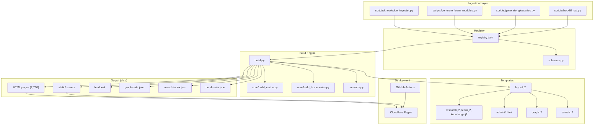

# Architecture Overview

AcaciaFund is a **static site generator** purpose-built for a three-pillar content taxonomy. It transforms a JSON content registry into a fully static HTML site with integrated search, knowledge graph visualization, and an admin dashboard.

## High-Level Architecture

## Core Components

| Component | File(s) | Purpose |
|-----------|---------|---------|
| **Config** | `config.py` | Single source of truth for pillar mapping, subcategories, quality thresholds, site settings |
| **Build Entry** | `build.py` (~3,726 lines) | Main build orchestrator: load registry, validate, render pages, generate taxonomies |
| **URL Helpers** | `core/urls.py` | Pure functions for slug translation, pillar mapping, path canonicalization |
| **Build Cache** | `core/build_cache.py` | Incremental build support with content hashing and parallel processing |
| **Taxonomy** | `core/build_taxonomies.py` | Admin pages, search index, tag pages, pillar pages, Atom feed |
| **Ontology** | `core/ontology.py` | Concept/Relation models, ontology manager, text extraction, Cytoscape export |
| **Schema Builder** | `core/schema_builder.py` | Prerequisite DAGs, learning paths, Bloom categorization |
| **Retention** | `core/retention_engine.py` | SM-2 spaced repetition, gap detection, interleaved scheduling |
| **Adaptive** | `core/adaptive.py` | User profiling, difficulty adaptation, content ranking |
| **Provenance** | `core/source_trail.py`, `core/contradiction.py`, `core/evidence_grade.py` | Claims, contradictions, evidence grading |
| **Content** | `core/content.py` | Content model wrapper and helpers |
| **Validator** | `core/validator.py` | Registry content validation against schema |
| **Assets** | `core/assets.py` | Asset pipeline management |
| **Visuals** | `core/visuals.py` | OG images, topic icons, thumbnail generation |
| **Brand** | `core/brand.py` | Brand colors, section type colors |
| **Score** | `core/score.py` | SQI (Semantic Quality Index) computation |
| **CMS** | `scripts/serve_cms.py`, `scripts/cms_api.py` | Dev server, admin CRUD, versioning, media, build trigger |

## Key Design Decisions

1. **Static-first**: No runtime backend. Everything is pre-built to HTML + JSON.
2. **Pillar-first URLs**: All content is organized under `/compliance/`, `/markets/`, or `/data/`.
3. **Incremental builds**: Content hashing avoids re-rendering unchanged items.
4. **Client-side search**: Fuse.js runs entirely in the browser — zero server cost.
5. **Plausible analytics**: Privacy-preserving, no cookies.
6. **Ontology-driven**: Concepts and relations enrich search results and the knowledge graph.
7. **Cognitive architecture**: Schema builder → learning paths → SM-2 retention → adaptive presentation.
8. **Research provenance**: Source trails → contradiction detection → evidence grading → export.
9. **Admin CMS**: Lightweight HTTP server (`serve_cms.py`) with registry CRUD, versioning, media, and build triggering.

## Architecture Invariants

- **Never redefine `PILLAR_URL_MAP` locally** — always import from `config.py`
- **Slugs use internal keys** (`aml`, `stock`, `data-engineering`), translated at build time
- **`core/urls.py` has no heavy dependencies** — safe for test imports
- **All admin templates MUST extend `admin/base.html`**
- **Use `python3`** — the platform `python` may lack dependencies

> **Next:** [Pillar System](pillars.md) — understanding the three-pillar taxonomy and URL mapping.
