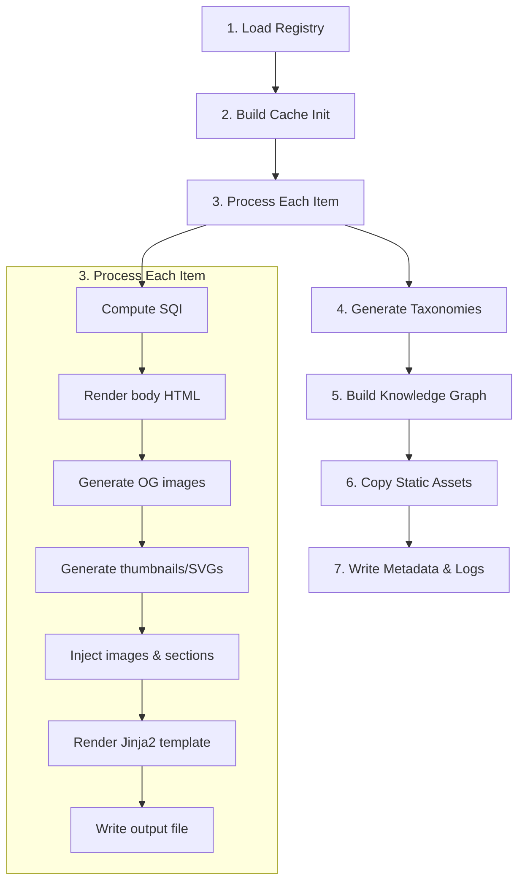

# Build Pipeline Overview

The build pipeline (`build.py`, ~3667 lines) is the core of AcaciaFund. It transforms `registry.json` into a fully static HTML site.

## Entry Point

```bash
# Standard build (incremental)
python3 build.py

# Full rebuild (clear cache)
rm -rf dist .build_cache.json && python3 build.py
```

## Build Phases

The `main()` function in `build.py` executes these phases in order:



### Phase 1: Load Registry

- Reads and parses `registry.json`
- Validates all items against `schemas.py:RegistryData`
- Loads admin credentials from `.env` (`load_admin_credentials()`)
- Loads ontology from `data/ontology.json` (if available)

### Phase 2: Build Cache Init

- Loads existing cache from `.build_cache.json`
- Initializes worker pool for parallel processing (`parallel_map`)
- Sets up Jinja2 environment with template loader
- Determines full rebuild or incremental based on `URL_STRUCTURE_VERSION`

### Phase 3: Process Items

For each content item (skipped if cache says unchanged):

1. **Compute SQI** (`_compute_sqi_for_item`) — Semantic Quality Index from readability, topical score, recency, concept overlap
2. **Render body** (`_process_item_body`) — Strip emoji, clean HTML, extract headings
3. **Generate images** (`_generate_page_images`) — OG image, thumbnail, featured image, section images
4. **Generate SVGs** (`_generate_page_svgs`) — Topic icons, card pictograms
5. **Inject images** (`inject_section_images`) — Place section images into body HTML
6. **Render template** — Select template based on `content_type`: `research.j2`, `learn.j2`, `knowledge.j2`
7. **Write output** — Write `index.html` to the correct pillar path

### Phase 4: Generate Taxonomies

Delegated to `core/build_taxonomies.py`:

- `generate_admin_pages()` — 12 admin dashboard pages
- `generate_search_pages()` — Search page + `search-index.json`
- `generate_tag_pages()` — Tag archive pages (one per tag)
- `generate_pillar_pages()` — Pillar landing pages (`/compliance/`, `/markets/`, `/data/`)
- `generate_feed()` — Atom feed (`feed.xml`)

### Phase 5: Build Knowledge Graph

- Runs `scripts/build_knowledge_graph.py` as a subprocess
- Merges ontology concepts/relations into Cytoscape-compatible JSON
- Writes `graph-data.json` to `dist/static/`

### Phase 6: Copy Static Assets

- Copies files from `static/` to `dist/static/`
- Handles CSS, JS, images, fonts, redirects

### Phase 7: Write Metadata

- Writes `build-meta.json` (timing, page counts, SQI stats)
- Writes `build_errors.log` (empty = clean build)
- Writes `_redirects` for Cloudflare Pages

## Key Functions

| Function | Line | Purpose |
|----------|------|---------|
| `main()` | 1361 | Build orchestrator |
| `_compute_sqi_for_item()` | 614 | SQI computation from signals |
| `_process_item_body()` | 1310 | HTML cleaning and heading extraction |
| `_generate_page_images()` | 1327 | Image generation pipeline |
| `_generate_page_svgs()` | 1339 | SVG topic icon generation |
| `get_topic_icons()` | 165 | Map tags to SVG icon paths |
| `find_related()` | 388 | Find related items by tag overlap |
| `find_cross_pillar()` | 425 | Find cross-pillar connections |
| `generate_sqi_badge()` | 590 | SQI badge HTML generation |
| `interest_score()` | 1211 | Compute interest score (SQI + recency) |

## Build Metrics Reference

Generated in `dist/build-meta.json`:

| Field | Type | Description |
|-------|------|-------------|
| `build_time_s` | float | Total build wall-clock time |
| `pages_total` | int | Total HTML pages generated |
| `registry_items` | int | Total items in registry |
| `skipped_items` | int | Items skipped by incremental cache |
| `sqi_avg` | float | Average SQI across all items |
| `sqi_below_threshold` | list | Items with SQI < 0.65 |
| `generated_at` | str | ISO timestamp |
| `url_structure_version` | str | Cache-busting version key |

> **See also:** [Incremental Build](incremental-build.md), [Taxonomy Generation](taxonomies.md), [Troubleshooting](troubleshooting.md)
