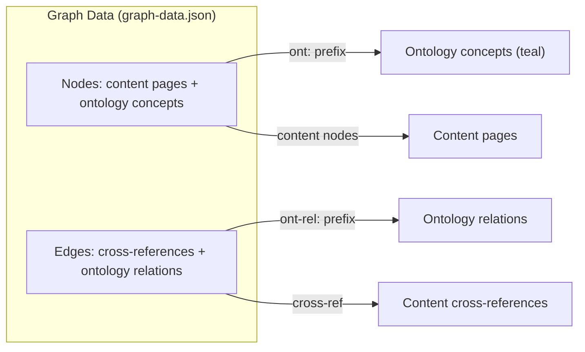

# Cytoscape Graph Export

Ontology concepts and relations are exported to a Cytoscape.js-compatible JSON format for the knowledge graph visualization.

## Export Functions

### Nodes

```python
def to_cytograph_nodes(self) -> list[dict]:
    # Returns list of node dicts
```

Node format:

```json
{
  "data": {
    "id": "ont:kyc",
    "label": "KYC",
    "type": "concept",
    "pillar": "aml",
    "category": "cdd-kyc",
    "color": "#14b8a6"
  }
}
```

- All concept nodes have `type: "concept"`
- ID prefix `ont:` distinguishes ontology nodes from content nodes
- Teal color (`#14b8a6`) for all ontology concepts
- Pillar and category are included for filtering

### Edges

```python
def to_cytograph_edges(self) -> list[dict]:
    # Returns list of edge dicts
```

Edge format:

```json
{
  "data": {
    "id": "ont-rel:0",
    "source": "ont:kyc",
    "target": "ont:data-governance",
    "relation": "requires",
    "strength": 0.8,
    "pillar": "cross-pillar"
  }
}
```

- Edge ID prefix: `ont-rel:{i}`
- `source` and `target` reference node IDs (with `ont:` prefix)
- `relation` is the relation type label
- `strength` is the relation weight (0.0–1.0)

## Merge Into Existing Graph

```python
def merge_into_cytograph(self, cytograph: dict) -> dict:
    # Merges ontology nodes/edges into existing graph
    # Deduplicates by node/edge ID
    # Returns updated cytograph dict
```

This function:
1. Adds concept nodes that don't already exist
2. Adds relation edges that don't already exist
3. Preserves existing non-ontology nodes and edges

## Graph Data File

The merged graph is written to `dist/static/graph-data.json` during build and consumed by `templates/graph.j2`.



> **See also:** [Graph Visualization](graph-visualization.md), [Ontology Model](ontology-model.md)
