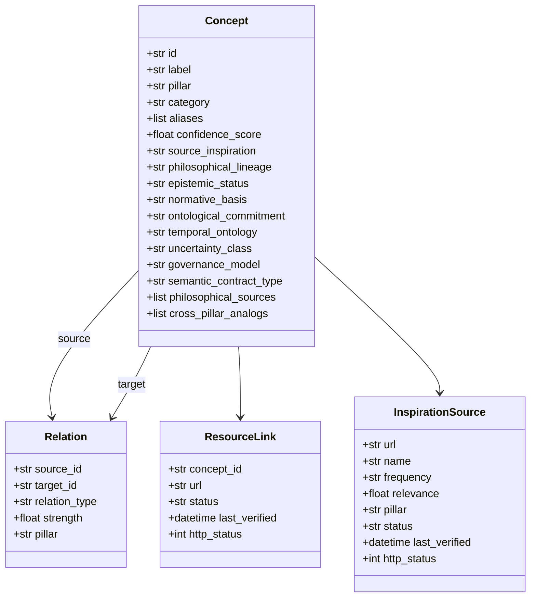

# Ontology Model

The ontology framework (`core/ontology.py`, ~75 KB) provides structured knowledge representation across the three pillars. It uses Pydantic v2 models and supports concept management, relation mapping, text extraction, philosophical metadata, and Cytoscape export. For the canonical overview, see [`ONTOLOGY.md`](../../ONTOLOGY.md).

## Data Models



### Concept

| Field | Type | Description |
|-------|------|-------------|
| `id` | str | Slug-style identifier (e.g., `kyc`, `delta-lake`) |
| `label` | str | Human-readable name (use `label`, not `name`) |
| `pillar` | str | `aml`, `stock`, `data-engineering`, or `cross-pillar` |
| `category` | str | Subcategory from `PILLAR_SUBCATEGORIES` |
| `aliases` | list[str] | Alternative names for text matching |
| `confidence_score` | float | Extraction confidence (0.0–1.0) |
| `source_inspiration` | str | Originating source URL or org |
| `philosophical_lineage` | str | Thinker → concept → technique genealogy |
| `epistemic_status` | str | Epistemic role (Constitutive, Instrumental, Regulatory, …) |
| `normative_basis` | str | Normative theory (Kantian, Utilitarian, Rawlsian, …) |
| `ontological_commitment` | str | What the concept presumes to exist |
| `temporal_ontology` | str | Time model the concept operates under |
| `uncertainty_class` | str | How uncertainty is represented |
| `governance_model` | str | Who/what governs application of the concept |
| `semantic_contract_type` | str | Nature of the concept's semantic contract |
| `philosophical_sources` | list[str] | Primary philosophical references |
| `cross_pillar_analogs` | list[dict] | Same epistemic pattern in other pillars |

### Relation

| Field | Type | Description |
|-------|------|-------------|
| `source_id` | str | Source concept ID |
| `target_id` | str | Target concept ID |
| `relation_type` | str | One of 10 types: `part_of`, `enables`, `requires`, `influences`, `detects`, `regulates`, `supersedes`, `measures`, `implements`, `related_to` |
| `strength` | float | Relationship strength (0.0–1.0, use `strength` not `weight`) |
| `pillar` | str | Pillar or `cross-pillar` |

### ResourceLink

| Field | Type | Description |
|-------|------|-------------|
| `concept_id` | str | Related concept ID |
| `url` | str | External resource URL |
| `status` | str | `active`, `degraded`, `error` |
| `last_verified` | datetime | Last HTTP check timestamp |
| `http_status` | int | Last HTTP status code |

### InspirationSource

| Field | Type | Description |
|-------|------|-------------|
| `url` | str | Source URL |
| `name` | str | Human-readable name |
| `frequency` | str | Update frequency |
| `relevance` | float | Relevance score (0.0–1.0) |
| `pillar` | str | Associated pillar |
| `status` | str | `active`, `degraded`, `error` |
| `last_verified` | datetime | Last HTTP check |
| `http_status` | int | Last HTTP status code |

## OntologyManager

The central class for managing the ontology:

### Key Methods

| Method | Description |
|--------|-------------|
| `add_concept(id, label, pillar, ...)` | Add or update a concept |
| `get_concept(id)` | Get concept by ID |
| `resolve_alias(text)` | Find concept by alias match |
| `find_concepts(query)` | Search concepts by name/label |
| `concepts_by_pillar(pillar)` | Get all concepts for a pillar |
| `add_relation(source_id, target_id, type, ...)` | Create a directed relation |
| `relations_for(concept_id)` | Get all relations for a concept |
| `related_concepts(concept_id)` | Get related concepts with relation info |
| `to_dict()` / `from_dict()` | Serialize/deserialize |
| `save(path)` / `load(path)` | Persist to/load from JSON file |
| `to_cytograph_nodes()` / `to_cytograph_edges()` | Export to Cytoscape format |
| `merge_into_cytograph(cytograph)` | Merge into existing Cytoscape graph |
| `seed_pillar(pillar)` | Seed canonical concepts for a pillar |
| `seed_all_pillars()` | Seed all 3 pillars |
| `seed_relations()` | Create cross-pillar relations |
| `concept_count()` | Total number of concepts |
| `relation_count()` | Total number of relations |

## Current State

| Metric | Value |
|--------|-------|
| Total concepts | 192 (58 compliance, 64 markets, 70 data) |
| Total relations | 434 |
| Relation types | 10 (`part_of`, `enables`, `requires`, `influences`, `detects`, `regulates`, `supersedes`, `measures`, `implements`, `related_to`) |
| Concepts with `epistemic_status` | 199 |
| Concepts with `cross_pillar_analogs` | 199 |

> **Note:** Counts verified 2026-08-03 from `data/ontology.json`. The earlier documentation value of 48 concepts / 5 relation types reflects the initial seed and is obsolete.

## Philosophical Foundations (Phase 2B)

Every concept carries 10 philosophical metadata fields (see Concept table). These are merged into the ontology by `scripts/enrich_philosophy.py` from `data/philosophy_metadata.json`, validated bidirectionally by `scripts/validate_cross_pillar.py`, and rendered on concept detail pages via the partials `philosophical_lineage.j2`, `epistemic_badge.j2`, `normative_basis.j2`, and `cross_pillar_philosophy.j2`.

## Retention Integration (Phase 3)

`core/retention_engine.py` schedules all 199 concepts through SM-2 review with gap detection and interleaved practice. Concept review data is exported to `dist/static/review_concepts.json` at build time for the client-side engine (`static/js/retention_engine.js`).

## Persistence

Ontology is persisted to `data/ontology.json`:

```python
# Save
mgr.save("data/ontology.json")

# Load
mgr = OntologyManager.load("data/ontology.json")
```

## Usage Examples

### Create and seed
```python
from core.ontology import OntologyManager
mgr = OntologyManager()
mgr.seed_all_pillars()
mgr.seed_relations()
mgr.save("data/ontology.json")
```

### Query
```python
concepts = mgr.concepts_by_pillar("aml")
related = mgr.related_concepts("kyc")
```

### Export to graph
```python
cytograph = {"nodes": [], "edges": []}
cytograph = mgr.merge_into_cytograph(cytograph)
# Result has ont:{id} concept nodes + ont-rel:{i} edges
```

> **See also:** [Concept Extraction](concept-extraction.md), [Cytoscape Export](cytograph-export.md), [Source Freshness](source-freshness.md)
