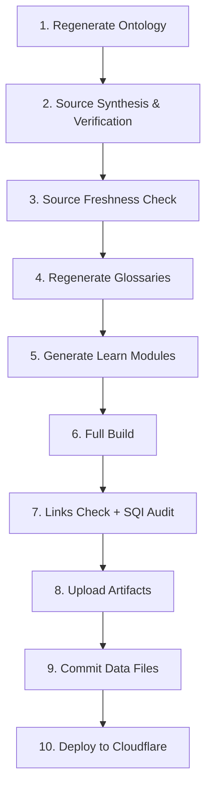

# Weekly Refresh Workflow

The weekly refresh workflow runs every Monday at 04:00 UTC via `.github/workflows/source-refresh.yml`. It regenerates ontology, glossaries, and content, then builds and deploys.

## Workflow Jobs



## Detailed Steps

### 1. Regenerate Ontology

```bash
python3 -c "
from core.ontology import OntologyManager
m = OntologyManager()
m.seed_all_pillars()
m.seed_relations()
m.save('data/ontology.json')
"
```

Seeds the ontology (199 concepts, 449 relations).

### 2. Source Synthesis & Verification

```bash
python3 scripts/source_synthesis.py
python3 scripts/source_verification.py
```

Updates inspiration source data and verifies source domains.

### 3. Source Freshness Check

```bash
python3 scripts/check_source_freshness.py --update-ontology
```

HEAD checks all 32 sources, writes `data/source_health.json`.

### 4. Regenerate Glossaries

```bash
python3 scripts/generate_glossaries.py
```

Generates per-pillar glossary pages from ontology concepts.

### 5. Generate Learn Modules

```bash
python3 scripts/generate_learn_modules.py
```

Generates or updates learn modules with Bloom questions and flashcards.

### 6. Full Build

```bash
rm -rf dist .build_cache.json && python3 build.py
```

Full rebuild (no cache) to ensure clean output.

### 7. Links Check + SQI Audit

```bash
python3 scripts/check_links_and_sqi.py --dist-dir dist
```

Checks for broken links and audits SQI scores.

### 8. Upload Artifacts

Artifacts retained for 30 days:
- `dist/` (built site)
- `registry.json` (updated registry)
- `data/ontology.json` (ontology)
- `data/source_health.json` (freshness data)

### 9. Commit Data Files

Commits updated data files back to the repository:
- `data/ontology.json`
- `registry.json`
- `data/source_health.json`

### 10. Deploy to Cloudflare

Publishes `dist/` to Cloudflare Pages.

## Workflow Triggers

| Trigger | Schedule |
|---------|----------|
| Scheduled | Monday 04:00 UTC |
| Manual | `workflow_dispatch` via GitHub UI |
| API | `repository_dispatch` via deploy script |

> **See also:** [Cloudflare Deploy](cloudflare-deploy.md), [Source Freshness](../04-ontology-knowledge-graph/source-freshness.md)
